<div align="center">

# AL-Madenah Platform

**A modular-monolith business platform for a Qatari real-estate operator — built so that Real Estate is the _first_ module, not the only one.**

[](https://dotnet.microsoft.com/)
[](https://react.dev/)
[](https://www.microsoft.com/sql-server)
[](docs/ARCHITECTURE.md)
[](docs/DEPLOYMENT.md)

[Architecture](docs/ARCHITECTURE.md) · [System Design](docs/SYSTEM_DESIGN.md) · [Modules](docs/MODULES.md) · [API](docs/API.md) · [Database](docs/DATABASE.md) · [Developer Guide](docs/DEVELOPER_GUIDE.md) · [Testing](docs/TESTING.md) · [Deployment](docs/DEPLOYMENT.md) · [Security](docs/SECURITY.md) · [Roadmap](docs/ROADMAP.md)

</div>

---

## What this actually is

Most real-estate codebases are a website with a database behind it. This one is not.

The system is an **internal business platform**: the software an operating company runs on. Property listings are the first business capability it happens to expose, because that is where the revenue is today. The architecture — two independently-schemad modules sitting on a shared kernel, wired together only at the composition root — exists so that the second, third and fourth capabilities can be added by writing a new module, not by refactoring the existing one.

Concretely, that means:

- **`Auth` and `RealEstate` are peers.** Neither references the other. Their EF Core models live in separate SQL schemas (`auth`, `realestate`) with separate migration histories, so they migrate independently and in either order.
- **Everything shared is pushed down**, never sideways. The permission catalogue, the `Result<T>` type, the HTTP error mapper and the base controller live in `BuildingBlocks/` and are consumed by both modules. A module never becomes a dependency of another module.
- **Adding a business capability is additive.** A `Notifications` or `Contracts` or `Accounting` module is a new folder under `src/Modules/`, four new projects, one new schema, and three lines in `Program.cs`. No existing module changes.

The Real Estate module is a full operational surface in its own right — 49 seeded listings, viewport map search, lead capture, an image store, a permissioned admin console, and a public site — but it is deliberately shaped as *one tenant of a platform* rather than *the platform*.

> The long-term module roadmap — notifications (WhatsApp / email / SMS), background jobs, reporting, scheduling, workflow automation — is documented in **[docs/ROADMAP.md](docs/ROADMAP.md)** and is explicitly **not implemented today**. This README describes only what is in the code.

---

## Screenshots

> The images below are **generated placeholders**. Drop real screenshots over them using the same filenames and the gallery updates itself — see [`docs/images/README.md`](docs/images/README.md) for sizing and naming conventions.

|  |  |
|---|---|
| **Home** — hero, search, featured grid<br>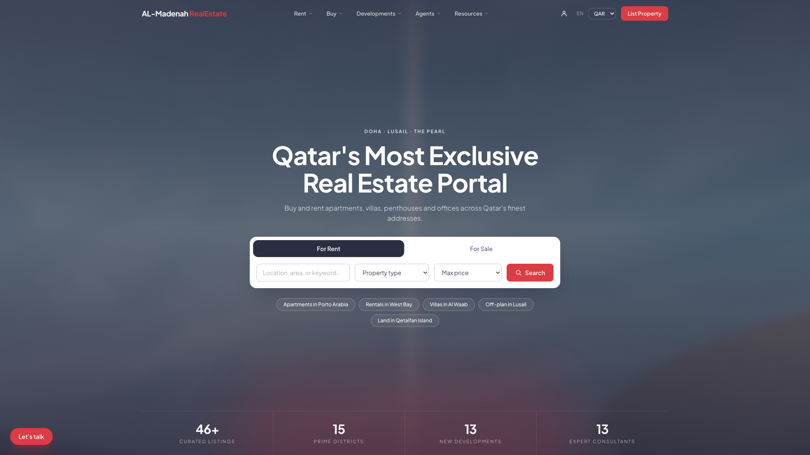 | **Listings** — filters, sorting, pagination<br>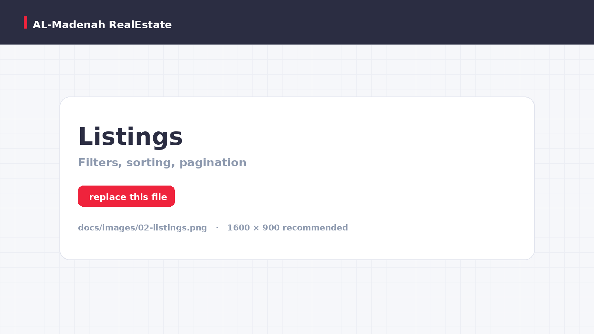 |
| **Property Details** — gallery, specs, agent, map<br>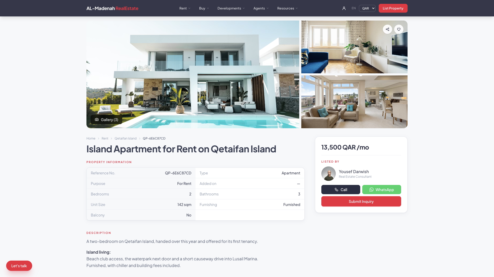 | **Map Search** — viewport query, price bubbles<br>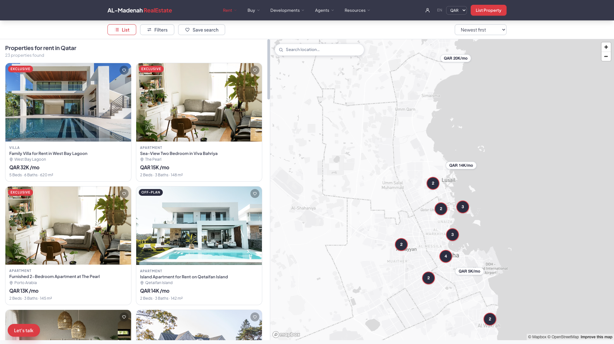 |
| **Admin Dashboard** — statistics, most-viewed<br>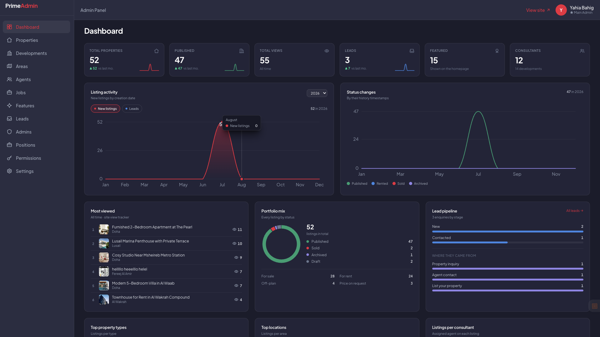 | **Admin Permissions** — positions and permission catalogue<br>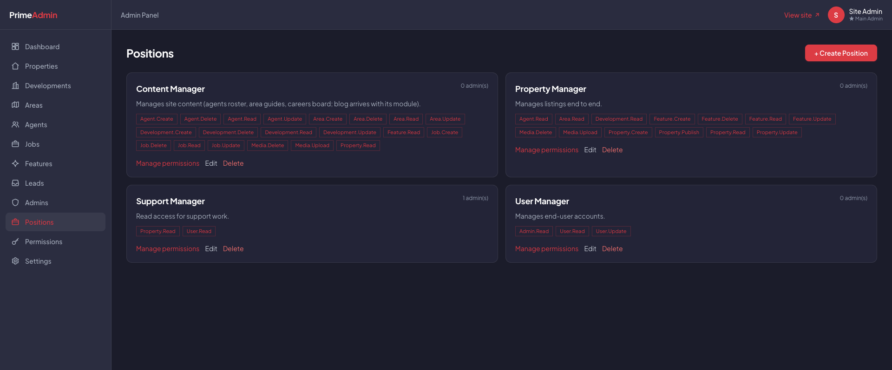 |
| **Positions & Permissions**<br> | **Mobile**<br>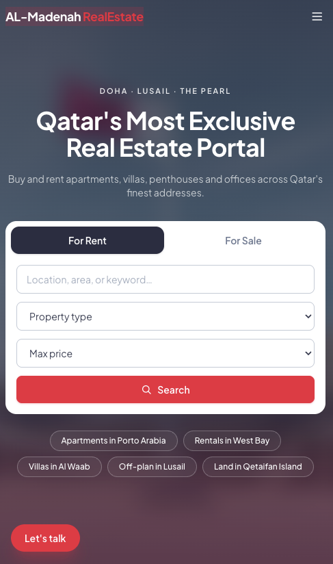 |

---

## Architecture at a glance

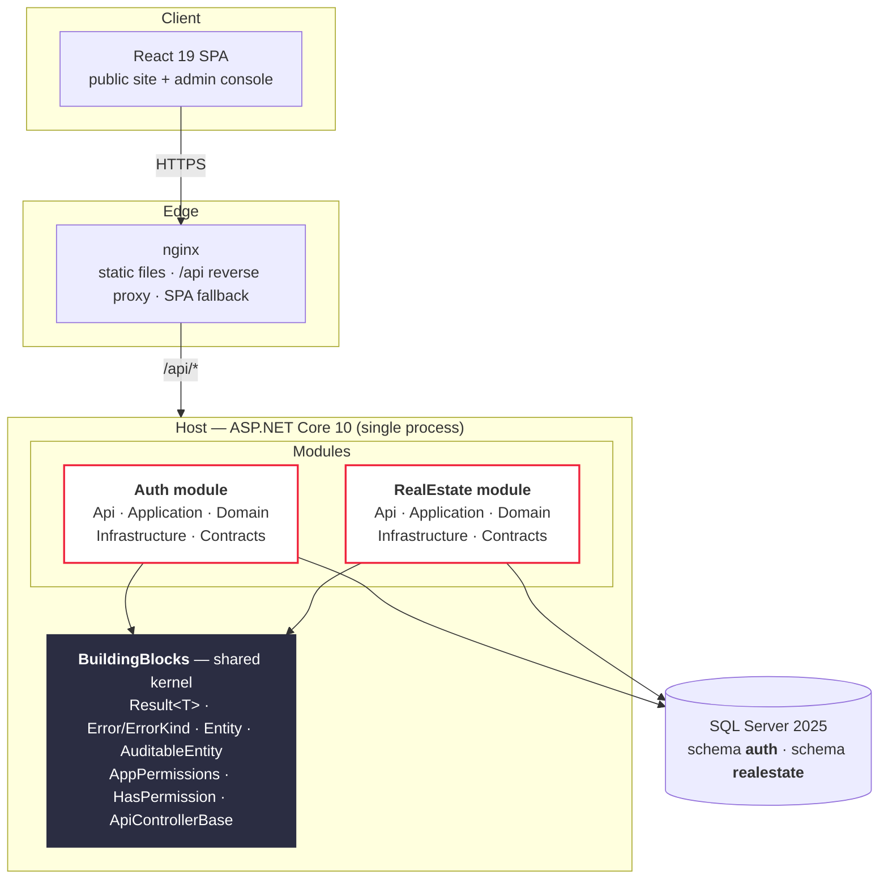

Inside every module the dependency arrows point one way only — **inward, toward the domain**:

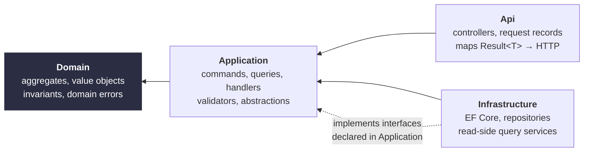

`Domain` references nothing but the shared kernel. `Infrastructure` depends on `Application` — never the reverse — so the persistence technology is an implementation detail that the business rules never see. Full reasoning, including the trade-offs and where this design would be the wrong choice, is in **[docs/ARCHITECTURE.md](docs/ARCHITECTURE.md)**.

---

## Request lifecycle

Every write follows the same path. Nothing is special-cased.

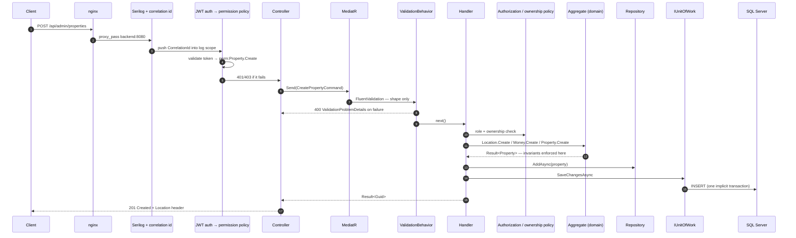

Two properties of this pipeline are worth stating explicitly:

- **Expected failures are values, not exceptions.** A missing listing, a duplicate slug, a forbidden action — all travel as `Result<T>` carrying an `Error` with an `ErrorKind`, and one mapper turns that kind into 400/401/403/404/409. Exceptions are reserved for genuine bugs and are caught once, by `GlobalExceptionHandler`, which returns RFC 9457 `ProblemDetails` and leaks internals only in Development.
- **Validation and invariants are different jobs.** FluentValidation checks *shape* (is the title present, is the page size sane). The aggregate checks *rules* (can a Draft listing be featured, does an Installment plan match its currency). The validators say so in their own comments.

---

## Tech stack

| Layer | Choice | Why |
|---|---|---|
| Runtime | .NET 10, ASP.NET Core, C# 13 | Long-term support; the module boundaries are compiler-enforced by project references |
| Mediation | MediatR 12 | One dispatch point, which is where cross-cutting behaviours attach |
| Validation | FluentValidation | Shape validation outside the domain, composable per request |
| Persistence | EF Core 10 + SQL Server 2025 | Owned types map value objects to real, indexable columns |
| Logging | Serilog | Structured, with a per-request correlation id pushed into `LogContext` |
| API docs | Microsoft.AspNetCore.OpenApi | Served at `/openapi/v1.json` in Development |
| Frontend | React 19 · Vite 8 · Tailwind v4 · react-router 7 | Tailwind v4's CSS-first `@theme` keeps the design tokens in one file |
| Maps | MapLibre GL + OpenFreeMap tiles, bundled and code-split | No account, no token, no third-party script; routes without a map ship zero map bytes |
| Delivery | Docker Compose — SQL Server, API, nginx (+ optional Caddy TLS edge) | One `docker compose up -d` from bare VPS to running system |

---

## Quick start

**Prerequisites:** Docker + Docker Compose. Nothing else — the .NET SDK and Node are only needed for local development outside containers.

```bash
git clone https://github.com/yahyabahig-pixel/QatarRealEstate.git
cd QatarRealEstate

cp .env.example .env
# Fill in at minimum: SA_PASSWORD, JWT_SECRET (48+ chars), MAIN_ADMIN_EMAIL,
# MAIN_ADMIN_PASSWORD, PUBLIC_ORIGIN. Leaving the admin fields blank makes the
# auth seeder throw and the API crash-loop — that is deliberate, not a bug.

docker compose up -d --build
docker compose logs -f backend
```

The API applies both modules' migrations on start, then seeds roles, the Main Admin, four positions and the reference catalogues — each batch recorded in a `SeedHistory` table so it runs exactly once and anything deleted afterwards stays deleted. The ~695 rows of demo listings are **not** part of that: they are an explicit command, refused in Production, `docker compose run --rm backend seed --demo`.

| | |
|---|---|
| Site | `http://<host>` |
| Admin console | `http://<host>/admin/login` |
| OpenAPI (Development only) | `http://<host>/openapi/v1.json` |

Running the backend and frontend directly on your machine, the vertical-slice recipe for adding a feature, and the repo's naming conventions are all in **[docs/DEVELOPER_GUIDE.md](docs/DEVELOPER_GUIDE.md)**.

---

## Repository layout

```
src/
├─ BuildingBlocks/                 shared kernel — no module may be a dependency of another
│  ├─ BuildingBlocks.Domain/         Entity, AuditableEntity, Result<T>, Error, ErrorKind
│  ├─ BuildingBlocks.Application/    PaginatedList, ICachedQuery, pipeline behaviour bases
│  ├─ BuildingBlocks.Authorization/  AppPermissions catalogue, [HasPermission], policy provider
│  ├─ BuildingBlocks.Api/            ApiControllerBase, Result<T> → ProblemDetails mapper
│  └─ BuildingBlocks.Persistence/    (placeholder — currently empty)
├─ Modules/
│  ├─ Auth/                         identity, positions, permissions, JWT
│  │  └─ Api · Application · Contracts · Domain · Infrastructure
│  └─ RealEstate/                   listings, agents, areas, developments, leads, jobs, media
│     └─ Api · Application · Contracts · Domain · Infrastructure
└─ Host/                            composition root: DI, middleware, migrations, seeding

frontend/                           React SPA — public site + admin console
docker/                             nginx site config, Caddy TLS edge
docs/                               this documentation set
```

Sixteen projects, ~474 C# files, ~7,300 lines of frontend JavaScript.

---

## The two modules

| | **Auth** | **RealEstate** |
|---|---|---|
| Owns | Staff identity, roles, positions, permission grants, JWT issuance | Listings, agents, areas, developments, features, jobs, leads, image storage |
| Schema | `auth` | `realestate` |
| Aggregates | `Position` (+ `PositionPermission`) | `Property` (rich), `Agent`, `Area`, `Development`, `Feature`, `PropertyType`, `Job`, `Lead`, `StoredImage` |
| Public routes | `POST /api/auth/login` | 19 anonymous read/lead endpoints |
| Admin routes | `/api/admins`, `/api/positions`, `/api/permissions` | `/api/admin/*` — 34 endpoints across 8 resources |
| Distinctive | Permissions are **code constants**, positions are **data**; the Main Admin is protected by five independent mechanisms | `Property` is a real aggregate with a publication state machine, owned value objects three levels deep, and a denormalised lat/lng mirror for viewport search |

Full per-module analysis — every entity, invariant, endpoint and design decision — is in **[docs/MODULES.md](docs/MODULES.md)**.

---

## Authorization model

Permissions are `const string`s in `BuildingBlocks.Authorization.AppPermissions` — 41 of them across 11 groups. They are **not** table rows.

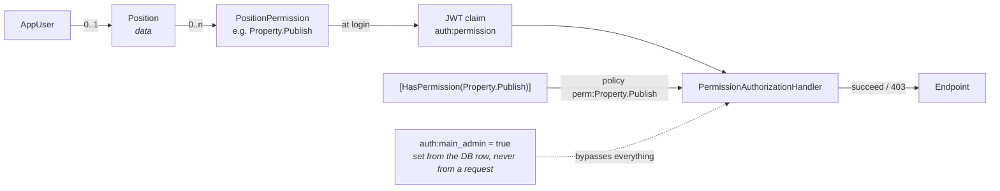

Adding a permission is one constant plus one attribute — no migration, no policy registration, because `PermissionPolicyProvider` builds `perm:*` policies on demand. Positions can only store strings that exist in the catalogue, validated inside the `Position` aggregate, so a typo can never sit dormant in the table.

The full model, the Main Admin's five layers of protection, and an honest list of the gaps — no token revocation, no refresh tokens — is in **[docs/SECURITY.md](docs/SECURITY.md)**. Login and the public write endpoints are rate-limited per client IP.

## Verifying a change

```bash
./scripts/verify.sh
```

One command: compiles the backend, runs the test suites, builds the frontend, and proves
end-to-end that a delete survives a restart — against a throwaway database that is deleted
afterwards. Your data is not touched. See **[docs/TESTING.md](docs/TESTING.md)**.

---

## Engineering decisions worth reading about

Each of these is argued properly — problem, alternatives, trade-offs, and when the other choice would win — in [docs/ARCHITECTURE.md](docs/ARCHITECTURE.md).

| Decision | One-line rationale |
|---|---|
| **Modular monolith over microservices** | One team, one deployable, one database, ACID transactions — with the module seams already cut, so extraction is a refactor rather than a rewrite |
| **Result&lt;T&gt; over exceptions** | Expected failures are part of the contract; making them a return type puts them in the signature instead of the docs |
| **Two persistence paths (repositories + query services)** | Writes need aggregates and invariants; reads need SQL projections and no object graph. Forcing both through one abstraction makes one of them bad |
| **Owned types, zero value converters** | Value objects flatten into real columns, so `Sale_Price` stays indexable and filterable — a JSON column would make the search endpoint impossible |
| **Denormalised `Latitude`/`Longitude`** | The canonical coordinates are strings inside a value object; a viewport query cannot parse `nvarchar` per row. A single private write path keeps the two representations from drifting |
| **Permissions as code, positions as data** | The catalogue is compile-time checked and greppable; the grants are runtime-editable by an administrator |
| **Blobs in SQL Server, not object storage** | At this scale it removes an entire moving part; the exit path is documented and localised to one query |

---

## Known limitations

This is an active codebase, not a finished product, and the documentation says so where it matters. The highest-impact items:

| Area | Issue |
|---|---|
| **Read authorization** | `GET /api/properties/{id}` applies no visibility filter — a Draft or Archived listing is publicly retrievable by id. Unpublishing does not take a listing off the internet |
| **Admin dashboard** | The status series are read from `PropertyStatusHistory`, but no runtime code writes to that table — only the seeder does. The Published/Sold/Rented columns report zero for all real activity |
| **Leads** | `AdminLeadsController` has no `[HasPermission]` because no `Lead.*` permission exists in the catalogue. Any authenticated principal can read and delete every lead |
| **Token lifecycle** | Permissions are frozen into the JWT for its 60-minute lifetime. Revoking a permission or deactivating an admin has no effect until the token expires |
| **Pipeline** | Both modules register their own copy of `ValidationBehavior<,>` into the same container, so every request is validated twice |
| **Tests** | There is no test project in the solution |

The full engineering backlog, with file references and suggested fixes, is at the end of [docs/ARCHITECTURE.md](docs/ARCHITECTURE.md#15-known-limitations-and-engineering-backlog).

---

## Security notice for this public repository

This code was published with permission. Before treating any value in it as safe:

- **`src/Host/appsettings.json`**, **`src/Host/appsettings.Development.json`** and **`src/Modules/Auth/Auth.Infrastructure/Data/AuthDbContextFactory.cs`** contain committed development credentials — a SQL Server `sa` password, a JWT signing secret and a Main Admin password. They are **development placeholders and must be treated as compromised**. Real values come from environment variables via `.env`, which is git-ignored.
- No credential, connection string, private hostname or token from this repository is reproduced anywhere in this documentation. Where one exists, it is referred to by file path and replaced with a placeholder.

See [docs/SECURITY.md](docs/SECURITY.md#credential-hygiene) for the remediation checklist.

---

## Contributing

Conventions, the branch and commit format, the definition of done, and the review checklist are in **[CONTRIBUTING.md](CONTRIBUTING.md)**. The short version: features are vertical slices, the domain owns invariants, `Infrastructure` never leaks into `Application`, and every handler returns `Result<T>`.

## License

No license file is present in this repository. Until one is added, all rights are reserved by the copyright holder and the code is published for review purposes only.
