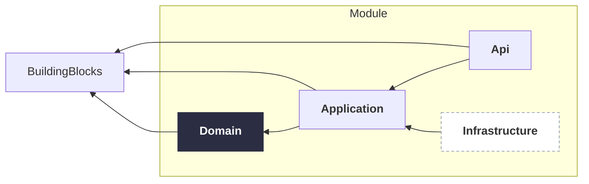
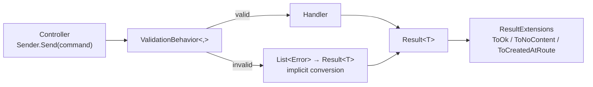
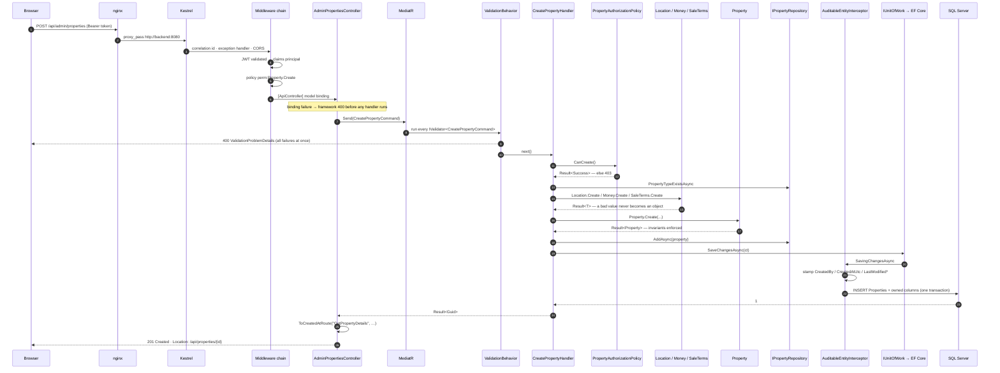
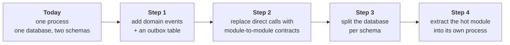

# Architecture

> An architecture review of the AL-Madenah platform, written from the code. Every claim below is traceable to a file; where something is *not* implemented, this document says so rather than describing what a project of this shape usually does.

**Contents**

1. [The problem this architecture solves](#1-the-problem-this-architecture-solves)
2. [Modular monolith](#2-modular-monolith)
3. [Clean architecture inside each module](#3-clean-architecture-inside-each-module)
4. [The layers](#4-the-layers)
5. [CQRS](#5-cqrs)
6. [MediatR and the pipeline](#6-mediatr-and-the-pipeline)
7. [The Result pattern](#7-the-result-pattern)
8. [Repository and Unit of Work](#8-repository-and-unit-of-work)
9. [Domain-driven design: what is and is not applied](#9-domain-driven-design-what-is-and-is-not-applied)
10. [Authorization architecture](#10-authorization-architecture)
11. [The request lifecycle, end to end](#11-the-request-lifecycle-end-to-end)
12. [Cross-cutting concerns](#12-cross-cutting-concerns)
13. [Why not microservices](#13-why-not-microservices)
14. [Extending the platform with a new module](#14-extending-the-platform-with-a-new-module)
15. [Known limitations and engineering backlog](#15-known-limitations-and-engineering-backlog)

---

## 1. The problem this architecture solves

The business is a real-estate operator. The software it needs is not "a property website" — it is the system the company runs on, of which the property catalogue is the first and currently the only revenue-bearing part. Over time the same platform is expected to carry notifications, scheduling, reporting and other operational capabilities (see [ROADMAP.md](ROADMAP.md)).

That produces a specific architectural requirement, and it is not a performance requirement:

> **Adding the second business capability must not require changing the first.**

Almost every design decision in this repository follows from that sentence. It is why there are sixteen projects instead of three, why `Auth` and `RealEstate` cannot see each other, why the permission catalogue lives in a shared kernel rather than in the module that first needed it, and why each module owns a database schema instead of a set of tables.

The secondary requirement is ordinary: a small team must be able to ship, deploy and debug the whole thing without a distributed-systems budget. That is why it is one process and one database.

---

## 2. Modular monolith

### What it means here

The system is a **single deployable ASP.NET Core process** containing **two independent business modules** plus a shared kernel:

```
src/
├─ BuildingBlocks/     ← shared kernel. Both modules depend on it.
├─ Modules/Auth/       ← Api · Application · Contracts · Domain · Infrastructure
├─ Modules/RealEstate/ ← Api · Application · Contracts · Domain · Infrastructure
└─ Host/               ← the ONLY project that references both modules
```

The rule that makes it a modular monolith rather than a large layered application is enforced by the compiler, not by discipline:

**No module project references any project belonging to another module.**

You can verify it in one command:

```bash
grep -rl "Modules/Auth" src/Modules/RealEstate --include=*.csproj      # → no results
grep -rl "Modules/RealEstate" src/Modules/Auth --include=*.csproj      # → no results
```

The only place the two modules meet is `src/Host/Program.cs`, which calls each module's registration extension in turn:

```csharp
builder.Services.AddApplication();                                   // RealEstate
builder.Services.AddRealEstateInfrastructure(builder.Configuration);
builder.Services.AddRealEstateApi();

builder.Services.AddAuthApplication();                               // Auth
builder.Services.AddAuthInfrastructure(builder.Configuration);
builder.Services.AddAuthApi();

builder.Services.AddPermissionAuthorization();                       // shared, once
```

### Database isolation

Each module owns a schema and its own migration history table:

| Module | `HasDefaultSchema` | Migration history | DbContext |
|---|---|---|---|
| Auth | `auth` | `auth.__EFMigrationsHistory` | `AuthDbContext : IdentityDbContext<AppUser, AppRole, Guid>` |
| RealEstate | `realestate` | `realestate.__EFMigrationsHistory` | `RealEstateDbContext : DbContext` |

They migrate independently and in either order (`Host/Startup/DatabaseStartupExtensions.cs`). There is **no foreign key that crosses schemas** — `Property.CreatedBy` holds an `AppUser.Id` as a bare `Guid` with no constraint, which is exactly the seam you would cut along if the modules were ever split.

Both contexts read the connection string named `RealEstateDb` and therefore share one physical database. That is a deliberate simplification, and a slightly unfortunate name: `Auth` reading a setting called `RealEstateDb` makes it look like a tenant of the other module. Splitting the databases later means changing that string, nothing more.

### The rule for shared code

When both modules needed a base controller, it did **not** move from `RealEstate.Api` into a reference from `Auth.Api`. It sank into `BuildingBlocks.Api`. The comment in `ApiControllerBase.cs` records the rule:

> *"Promoted from RealEstate.Api the day a second module (Auth) needed it — the modular-monolith rule: modules never reference each other, shared plumbing sinks into BuildingBlocks."*

This is the discipline that keeps a modular monolith from decaying into a distributed ball of mud in a single process. Every violation of it creates a dependency edge that must be severed before a module can ever be extracted.

### Contracts projects

Each module has a dependency-free `*.Contracts` project intended as its public wire surface — records only, no EF Core, no MediatR, no domain types. The idea is that a future module (or a client generator) can reference `Auth.Contracts` without dragging in Identity.

**Status, honestly:** `Auth.Contracts` is real and populated (7 request records, 5 response records) but **no other module references it**. `RealEstate.Contracts` contains a single empty placeholder class. So the contracts mechanism is *designed* but not yet *exercised* — which is unsurprising, since there is currently no cross-module call anywhere in the system. The one piece of genuine cross-module coupling is by convention rather than by reference: `Auth.Infrastructure.Identity.AuthRoles` and `RealEstate.Application.Common.AppRoles` are hand-maintained duplicates of the same three role names, with a comment acknowledging that they must match. Nothing enforces it. Promoting the role names into `BuildingBlocks.Authorization` next to `AppPermissions` would close that gap.

### Trade-offs

| | |
|---|---|
| **Buys** | One deployment, one database, real ACID transactions across a use case, in-process calls with no serialisation or network failure modes, one debugger, one log stream, one CI pipeline |
| **Costs** | Modules share a process — one memory leak or thread-pool exhaustion takes everything down. They share a runtime version and cannot be scaled independently. Isolation is a convention enforced by project references, which a determined developer can dissolve in one line |
| **Fails when** | Two capabilities need genuinely different scaling profiles or availability guarantees; teams grow past the point where one deploy pipeline is a bottleneck; a capability needs a different runtime or datastore |

---

## 3. Clean architecture inside each module

Within a module, the dependency graph is a strict inward chain:



Verified from the `.csproj` files:

| Project | References |
|---|---|
| `RealEstate.Domain` | `BuildingBlocks.Domain` — nothing else |
| `RealEstate.Application` | `RealEstate.Domain`, `BuildingBlocks.Domain`, `BuildingBlocks.Application`, MediatR, FluentValidation |
| `RealEstate.Infrastructure` | `RealEstate.Application`, EF Core + SqlServer |
| `RealEstate.Api` | `RealEstate.Application`, `BuildingBlocks.Api`, `BuildingBlocks.Authorization` |

The important arrow is the one that looks backwards: **`Infrastructure → Application`**, never the reverse. `Application` declares interfaces (`IPropertyRepository`, `IPropertyQueries`, `IUnitOfWork`, `ICurrentUser`); `Infrastructure` implements them and is bound at the composition root. Consequently:

- `Application` has no reference to EF Core. Swapping SQL Server for Postgres, or a repository for an HTTP client, touches one project.
- `Domain` has no reference to anything except the shared kernel's `Entity`/`Result` primitives. The business rules are testable with `new`, no database and no container.

### Where the theory is bent

Two deliberate deviations are worth naming, because pretending they are not there would make this document less useful than the code:

1. **`RealEstateDbContext` is declared in the global namespace** (no `namespace` statement). Every repository and query class references it unqualified. Harmless, but it means the type name is a global identifier in a solution with sixteen projects.
2. **The read side takes a shortcut through the layers on purpose.** Query services in `Infrastructure` project EF entities directly into Application-layer DTO records. No domain object is constructed. This is CQRS working as intended (see §5) but it does mean `Infrastructure` knows the shape of Application DTOs — which is why those DTOs live in `Application` and not in `Api`.

---

## 4. The layers

### Domain

**Owns:** entities, aggregate roots, value objects, enums, domain errors, invariants.
**Knows about:** `BuildingBlocks.Domain` only.

Everything that can be wrong about a listing is decided here, not in a controller and not in a validator. `Property.Publish()` returns `PropertyErrors.NotPublishable` if the listing is Archived, Sold or Rented. `SaleTerms.Create` refuses an installment plan on a cash sale. `Money.Create` refuses a negative amount. Construction is funnelled through static factories that return `Result<T>`, so an invalid aggregate cannot be built at all — there is no public constructor to misuse.

The clearest example of the layer earning its keep is `Property.ReplaceFeatures`, which reconciles a new feature set against the existing one in three phases — remove deselected, update survivors *in place*, add new — specifically so surviving rows keep their identity and the unique index `UX_PropertyFeature_NoDuplicates` is not violated mid-transaction by a delete-then-insert. The comment above it records the production failure that motivated the design.

### Application

**Owns:** use cases. One folder per use case, containing the command/query record, its handler, and optionally a validator.
**Knows about:** `Domain`, and interfaces it declares for infrastructure it needs.

A handler is thin by design. It loads an aggregate through a repository, calls a method on it, saves through the unit of work, and returns. It does not contain business rules — when you find an `if` in a handler it is almost always a *coordination* check (does the referenced area exist?) rather than an invariant.

The layer also owns the read model: `IPropertyQueries`, `IAgentQueries` and friends are declared here and return DTOs defined here.

### Infrastructure

**Owns:** EF Core mapping, migrations, repositories, query services, the audit interceptor, seeding, and in the Auth module the Identity and JWT implementations.
**Knows about:** `Application` (to implement its interfaces).

This is also where the value-object mapping lives, and it is the most technically interesting part of the layer. Every value object is an **owned type flattened into the owner's table with explicit column names** — three levels deep for `Property → SaleTerms → InstallmentPlan → Money`, producing `Inst_DownPayment` / `Inst_DownPayment_Currency`. There are **zero value converters and zero JSON columns** in the model. That choice is what makes `SearchAsync` able to filter and sort on `Sale_Price` in SQL rather than materialising every row (see §5).

Collections are field-backed: `Property` exposes `IReadOnlyCollection<Media>` while EF reads and writes the private `_media` list via `SetPropertyAccessMode(PropertyAccessMode.Field)`. Encapsulation survives persistence, which is the detail most DDD-on-EF codebases get wrong.

### Api

**Owns:** controllers, route templates, request records, and the translation of `Result<T>` into HTTP.
**Knows about:** `Application`, `BuildingBlocks.Api`, `BuildingBlocks.Authorization`.

Controllers are deliberately trivial — build the message, send it, map the result:

```csharp
[HttpPost]
[HasPermission(AppPermissions.Property.Create)]
public async Task<IActionResult> Create([FromBody] CreatePropertyCommand command, CancellationToken ct)
    => (await Sender.Send(command, ct)).ToCreatedAtRoute("GetPropertyDetails", id => new { id });
```

There is no business logic in the Api layer, no mapping, and no try/catch.

### BuildingBlocks — the shared kernel

| Project | Contents | Consumed by |
|---|---|---|
| `BuildingBlocks.Domain` | `Entity`, `AuditableEntity`, `DomainEvent`, `Result<T>`, `Error`, `ErrorKind` | every Domain and Application project |
| `BuildingBlocks.Application` | `PaginatedList<T>`, `ICachedQuery`, `IUser`, behaviour base classes | Application projects |
| `BuildingBlocks.Authorization` | `AppPermissions`, `AuthClaimTypes`, `HasPermissionAttribute`, `PermissionPolicyProvider`, `PermissionAuthorizationHandler` | both modules' Api and Domain |
| `BuildingBlocks.Api` | `ApiControllerBase`, `ResultExtensions` (the single `Result<T>` → `ProblemDetails` mapper) | both modules' Api |
| `BuildingBlocks.Persistence` | *empty placeholder* | nothing |

A shared kernel is a liability as well as an asset: everything in it is coupled to every module, so a change here can break the whole system. The bar for adding something is therefore "two modules already need it", not "a module might need it". `BuildingBlocks.Persistence` — currently a single generated `Class1.cs` — is a small violation of that bar and should either be filled or deleted.

---

## 5. CQRS

### How it is applied

CQRS here is **not** event sourcing, and there are **no separate read and write databases**. It is a split at the *persistence abstraction*, and it is thorough:

| | Write side | Read side |
|---|---|---|
| Abstraction | `IPropertyRepository`, `IAgentRepository`, … | `IPropertyQueries`, `IAgentQueries`, … |
| Returns | Tracked domain aggregates | DTO records |
| Tracking | Tracked (needed for change detection) | `AsNoTracking()` |
| Shape | Whole aggregate, `Include`d as needed | `Select(...)` projection composed in SQL |
| Invariants | Enforced by the aggregate | Not consulted — no entity is constructed |
| Commits | `IUnitOfWork.SaveChangesAsync` | none |

**No query in the RealEstate module ever materialises a domain entity.** That is the property that makes the split real rather than nominal. It is also what makes the search endpoint viable: `PropertyQueries.SearchAsync` composes filters over `Sale_Price`, `Location_City`, `Specs_Rooms` and the rest as SQL predicates, counts before paging, and short-circuits on zero results.

Shared `static readonly Expression<Func<T, TDto>>` projections (`PropertyQueries.ProjectToListItem`, `AgentQueries.Projection`, …) guarantee that every endpoint returning a list returns an identical shape.

### Why not one abstraction for both

A single generic `IRepository<T>` that serves both reads and writes forces one of the two to be bad:

- If it returns entities, every list endpoint loads whole aggregates with their media and features, then throws 90% of the data away. On a 24-row page of properties that is 24 aggregates, ~70 media rows and ~160 feature rows to render a card grid.
- If it returns DTOs, commands lose the aggregate and its invariants, and business rules migrate into handlers.

Splitting the abstraction lets each side be shaped by its actual job. The cost is two code paths to maintain and the risk that they disagree about what "visible" means — which is precisely the bug present today (see §15, item 1).

### Commands and queries

The Application layer defines four one-line marker interfaces over MediatR:

```csharp
public interface ICommand<TResponse> : IRequest<Result<TResponse>>;
public interface IQuery<TResponse>   : IRequest<Result<TResponse>>;
public interface ICommandHandler<TCommand, TResponse> : IRequestHandler<TCommand, Result<TResponse>> …
public interface IQueryHandler<in TQuery, TResponse>  : IRequestHandler<TQuery, Result<TResponse>> …
```

They add no behaviour. Their value is that the *intent* of a message is visible in its declaration, and that a future pipeline behaviour can constrain on `ICommand<>` — a transaction or outbox behaviour, say — without touching queries.

Commands with no payload return the marker structs `Created` / `Updated` / `Deleted`, which the HTTP mapper turns into 201 / 204 / 204.

**Inventory:** 36 commands and 29 queries in RealEstate; 13 commands and 7 queries in Auth.

---

## 6. MediatR and the pipeline

MediatR gives the system **one dispatch point**, and the value of a single dispatch point is that cross-cutting behaviour attaches in exactly one place instead of being repeated in ninety handlers.



`ValidationBehavior` runs every registered `IValidator<TRequest>`, collects **all** failures into `Error.Validation(propertyName, message)`, and short-circuits — turning the whole set into a `Result<T>` via its implicit conversion from `List<Error>`. The HTTP mapper then emits a single `ValidationProblemDetails` (400) grouped by property. The caller gets every problem at once, which is what a form needs.

### What is registered — and a defect

| Behaviour | Location | Registered? |
|---|---|---|
| `ValidationBehavior<,>` | `RealEstate.Application/Behaviors/` | ✅ by `AddApplication()` |
| `ValidationBehavior<,>` | `Auth.Application/Behaviors/` | ✅ by `AddAuthApplication()` |
| `ValidationBehavior<,>` | `BuildingBlocks.Application/Common/Behaviours/` | ❌ never registered |
| `UnhandledExceptionBehaviour<,>` | `BuildingBlocks.Application/Common/Behaviours/` | ❌ never registered |

Three copies of the same behaviour exist and two of them are registered as open generics into the **same root container**. Open-generic `IPipelineBehavior<,>` registrations apply to *every* MediatR request in the process, so **every request is validated twice** — Auth commands run RealEstate's copy and vice versa. Not a correctness bug (validation is idempotent) but wasted work and a genuinely confusing pipeline to debug.

The BuildingBlocks copy is also the *better* one: it constrains `where TResponse : IResult` and calls `ValidateAsync`. The registered copies constrain only `notnull` and short-circuit with `(TResponse)(dynamic)errors`, which compiles for any response type but throws `RuntimeBinderException` at runtime for anything that is not a `Result<T>`. They also call the synchronous `Validate`.

**Fix:** delete both module copies, register the BuildingBlocks one once in the Host. This is the single cheapest improvement available in the codebase.

### Behaviours deliberately absent

No logging, performance, caching, transaction, retry or idempotency behaviour is registered. `ICachedQuery` is declared in BuildingBlocks and has **zero references anywhere** — the caching seam is designed and unused. Request logging happens at the HTTP level via `UseSerilogRequestLogging`, not in the pipeline.

---

## 7. The Result pattern

### The idea

Expected failures are **return values**, not exceptions.

```csharp
public sealed class Result<TValue> : IResult<TValue>
{
    public bool IsSuccess { get; }
    public TValue Value { get; }
    public List<Error> Errors { get; }
    public Error TopError { get; }

    public TNext Match<TNext>(Func<TValue, TNext> onValue, Func<List<Error>, TNext> onError);

    public static implicit operator Result<TValue>(TValue value);
    public static implicit operator Result<TValue>(Error error);
    public static implicit operator Result<TValue>(List<Error> errors);
}
```

`Error` is a `readonly record struct` carrying `Code`, `Description` and an `ErrorKind` from `{ Failure, Unexpected, Validation, Conflict, NotFound, Unauthorized, Forbidden }`.

The implicit operators are what make it ergonomic. A handler returns `Error.NotFound(...)` or returns the value directly; no wrapping ceremony appears at the call site:

```csharp
var property = await _properties.GetByIdAsync(command.Id, ct);
if (property is null)
    return PropertyErrors.NotFound;          // implicit Error → Result<Updated>

var published = property.Publish();
if (published.IsError)
    return published.TopError;

await _unitOfWork.SaveChangesAsync(ct);
return Result.Updated;
```

### Why not exceptions

| | Exceptions | `Result<T>` |
|---|---|---|
| Visible in the signature | No | Yes |
| Cost | Stack unwind; meaningful under load | A struct on the heap-allocated result |
| Ignorable | Yes, silently, until production | Only by explicitly ignoring the value |
| Suits | Genuine bugs, unreachable states | Expected outcomes: not found, duplicate, forbidden |

A listing that does not exist is not exceptional — it is one of the two normal outcomes of a lookup. Encoding it as a return type puts it in the compiler's field of view instead of in a doc comment.

Exceptions are still used, for exactly the right thing: unexpected failures. `GlobalExceptionHandler` (an `IExceptionHandler`, the .NET 8+ replacement for hand-rolled middleware) is the last line of defence. It logs the full detail with the request's correlation id and returns `ProblemDetails` whose `Detail` is the real exception message **only in Development** — because exception messages routinely carry connection strings, table names and file paths.

### One mapper, one error shape

`BuildingBlocks.Api/Errors/ResultExtensions.cs` is the single place `Result<T>` becomes HTTP, for both modules:

| Condition | Response |
|---|---|
| Success + value | `200 OK` |
| Success + `Updated`/`Deleted` | `204 No Content` |
| Success + new id | `201 Created` + `Location` |
| **All** errors are `Validation` | `400` + `ValidationProblemDetails`, grouped by error code |
| Otherwise, first error's kind | `Validation→400 · Unauthorized→401 · Forbidden→403 · NotFound→404 · Conflict→409 · Failure/Unexpected→500` |

### Trade-offs and rough edges

- The pattern is viral: every layer that can fail must return `Result<T>`, which is verbose in long call chains without a `Bind`/`Map` combinator. Only `Match` exists here.
- For non-validation failures the mapper emits **only the first error** — the rest are dropped.
- `TopError` on a successful result returns `default(Error)` rather than throwing, so a misuse is silent.
- `PropertyErrors` mixes two abstractions: five of its members return `Result<Updated>` while the rest return `Error`, and two errors used by `Property.SetOffer` are constructed inline and appear in no catalogue at all, making them undiscoverable to anyone reading `DomainErrors/`.

---

## 8. Repository and Unit of Work

### Repository

One repository per aggregate root, each declared in `Application/abstractions/Persistence/` and implemented in `Infrastructure/Data/Repositories/`. They are **narrow and concrete** — no generic `IRepository<T>`, no `IQueryable` leaking out, no `Expression<Func<T,bool>>` parameters:

```csharp
public interface IPropertyRepository
{
    Task<Property?> GetByIdAsync(Guid id, CancellationToken ct = default);
    Task<Property?> GetByIdWithMediaAsync(Guid id, CancellationToken ct = default);
    Task<Property?> GetByIdWithFeaturesAsync(Guid id, CancellationToken ct = default);
    Task<bool>      PropertyTypeExistsAsync(Guid propertyTypeId, CancellationToken ct = default);
    Task            AddAsync(Property property, CancellationToken ct = default);
    void            Remove(Property property);
}
```

The separate `GetByIdWithMediaAsync` / `GetByIdWithFeaturesAsync` methods are the interesting part: they make the loading strategy an explicit decision of the use case rather than a lazy-loading accident. A handler that only changes the title does not pull 20 media rows.

**No repository calls `SaveChanges`.** They stage work; the handler commits.

### Unit of Work

```csharp
public interface IUnitOfWork
{
    Task<int> SaveChangesAsync(CancellationToken cancellationToken = default);
}
```

That is the entire interface, and `EfUnitOfWork` is thirteen lines forwarding to `RealEstateDbContext.SaveChangesAsync`. There is no `BeginTransaction`/`Commit`/`Rollback`.

This is a defensible minimum, and the reasoning is sound: repositories and the unit of work are all registered `Scoped` against the *same* scoped `DbContext`, so they share one change tracker; EF wraps everything pending in a single implicit transaction on `SaveChanges`. One commit per use case, called once at the end of each handler — 32 call sites across the RealEstate handlers, one per handler.

**What it does not give you** is a transaction spanning more than one `SaveChanges`, or one spanning both modules' contexts. Nothing today needs either. The day something does — a command that must write to `auth` and `realestate` atomically — this interface will need `BeginTransaction`, or the operation will need to become eventually consistent through an outbox.

Two deliberate bypasses:

1. **`PropertyViewRecorder`** uses `ExecuteUpdateAsync` to issue `UPDATE Properties SET ViewsCount = ViewsCount + 1 WHERE Id = @id` — no aggregate load, no change tracker, no unit of work. View counting is high-frequency and contention-prone, and pulling a whole aggregate to increment an integer would be both slow and a lost-update race. The trade-off, undocumented in the code: this write escapes the audit interceptor, so it does not bump `LastModifiedUtc`. That is almost certainly desirable.
2. **The seeder** calls `SaveChangesAsync` directly, eight times, because it runs outside any request scope.

---

## 9. Domain-driven design: what is and is not applied

### Applied

**Aggregates and boundaries.** `Property` is a genuine aggregate root: `Media` and `PropertyFeature` are reachable only through it (they have no `DbSet`), and everything else is referenced by id — `PropertyTypeId`, `AreaId`, `AgentId`. Consistency is enforced at the root, and the transaction boundary is the aggregate.

**Value objects.** `Money`, `Location`, `PropertySpecs`, `SaleTerms`, `RentTerms`, `InstallmentPlan` are `sealed record`s with structural equality and static `Create → Result<T>` factories. They are the reason a price cannot be negative and an installment plan cannot mix currencies.

**Factories and invariants.** No aggregate has a public constructor. `Property.Create` validates title length, required listing terms, and the presence of a location before an instance exists.

**A real state machine.** `Property.Status` moves `Draft → Published → {Sold, Rented, Archived}` and each transition is a method that returns a typed error when it is illegal: `Publish()` refuses an Archived listing; `MarkAsSold()` requires `Published`; `Feature()` refuses anything not `Published`.

**Ubiquitous language.** `Area` (a marketing district you browse by) is deliberately distinct from `Location` (the postal address of a specific listing), and the entity header comment says so. `Development` models an off-plan project; `Lead` models an inbound enquiry with three shapes selected by factory rather than by inheritance.

### Not applied

**Domain events.** `Entity` exposes `AddDomainEvent`/`DomainEvents` and `DomainEvent` exists as an abstract class — with its `INotification` inheritance commented out. **`AddDomainEvent` is called zero times in the entire solution**, and neither `SaveChanges` override nor dispatcher exists. The seam is cut and unused. This is the single most consequential piece of missing DDD infrastructure, because it is what a `Notifications` module would attach to (see [ROADMAP.md](ROADMAP.md)).

**Specifications.** No specification pattern; query composition happens directly in the query services.

**Repositories per aggregate — with two gaps.** There is no `IPropertyTypeRepository` and no `IPropertyStatusHistoryRepository`. `PropertyTypes` is a seed-only table with no admin CRUD; `PropertyStatusHistory` is write-only from the seeder (see §15).

**Bounded contexts as separate models.** `Auth` and `RealEstate` are separate modules but they are not separate *contexts* in the strict sense — there is no anti-corruption layer between them because there is no interaction between them at all.

---

## 10. Authorization architecture

Two orthogonal mechanisms, deliberately kept apart.

### Permissions are code; positions are data

```
AppPermissions (41 const strings, 11 groups)   ← compile-time catalogue, in BuildingBlocks
        ↑ validated against
Position  ──0..n──▶  PositionPermission        ← runtime data, in the auth schema
        ↑ 0..1
     AppUser
```

Adding a permission is **one constant plus one attribute** — no migration, no policy registration:

```csharp
public const string Publish = "Property.Publish";      // AppPermissions.Property

[HasPermission(AppPermissions.Property.Publish)]       // any controller, any module
```

`HasPermissionAttribute` is an `AuthorizeAttribute` whose policy name is `perm:Property.Publish`. `PermissionPolicyProvider` intercepts any policy starting with `perm:` and builds a `PermissionRequirement` on the fly, falling back to the default provider for everything else. `PermissionAuthorizationHandler` renders the verdict.

`Position.AssignPermission` validates against `AppPermissions.Catalog` before a row can be written, so an un-catalogued string can never sit dormant in the table waiting for a matching permission to appear. A unique index `(PositionId, PermissionName)` backs the duplicate check.

**Why not permissions-as-rows?** Because a permission is a *code concept* — it only means anything if an endpoint checks it. Storing the catalogue in the database creates a class of bug where a row exists that nothing enforces, and another where an attribute references a name nobody granted. Keeping the catalogue in code makes it greppable, refactorable and compile-time checked; keeping the *grants* in the database is what an administrator actually needs to change at runtime.

### Claims are minted at login

`JwtTokenService` reads the user's roles and their position's permissions from the database and emits one `auth:permission` claim per grant, plus `auth:main_admin` when the row says so. **`PermissionAuthorizationHandler` never touches the database** — the entire authorization decision is made from the signed token.

That is fast and stateless. It is also the source of the module's biggest gap: permissions are frozen for the token's 60-minute lifetime, there is no refresh token, no logout, no revocation list and no `SecurityStamp` check, so revoking a permission or deactivating an admin has no effect until the token expires. See [SECURITY.md](SECURITY.md).

### Row-level ownership

Separately from permissions, three admin property queries scope results to `CreatedBy == currentUser` for non-privileged roles, and `PropertyOwnershipPolicy` guards the property mutation handlers. This is applied in `Application` (the decision) and executed in `Infrastructure` (the `WHERE` clause) — a clean split, and the query service's comment says so.

**Asymmetry to be aware of:** in-handler authorization exists for Property and Lead slices only. Agent, Area, Development, Feature, Job and Media handlers rely entirely on the `[HasPermission]` attribute at the controller. That is fine while HTTP is the only entry point; it becomes a hole the moment a background job or another module dispatches those commands directly.

---

## 11. The request lifecycle, end to end

### Middleware order (`Host/Program.cs`)

```
RequestLogContextMiddleware   ← FIRST: pushes TraceIdentifier as CorrelationId into Serilog's LogContext
UseExceptionHandler           ← GlobalExceptionHandler
UseSerilogRequestLogging
[Development] MapOpenApi
UseHttpsRedirection           ← config-gated; false behind the nginx/Caddy edge
UseCors("Frontend")           ← before auth, so even a 401 carries CORS headers
UseAuthentication             ← who are you
UseAuthorization              ← may you
MapControllers
```

The correlation middleware is first on purpose: every structured log line written anywhere downstream — handlers, EF Core, the exception handler — carries the same id, because `LogContext.PushProperty` flows through `await`.

`UseCors` before `UseAuthentication` matters more than it looks. If a 401 is returned without CORS headers, the browser reports a generic network error and the SPA cannot tell "not logged in" from "server down".

### Full write path



### Read path

Reads skip the domain entirely: controller → MediatR → handler → `I*Queries` → `AsNoTracking().Select(...)` → DTO → `ToOk()`. No aggregate is constructed, no interceptor runs, no `SaveChanges` is called.

---

## 12. Cross-cutting concerns

| Concern | Status | Where |
|---|---|---|
| **Structured logging** | ✅ | Serilog, console sink, correlation id per request |
| **Global exception handling** | ✅ | `GlobalExceptionHandler` → RFC 9457 `ProblemDetails`; details in Development only |
| **Validation** | ✅ (registered twice — §6) | FluentValidation via pipeline behaviour |
| **Auditing** | ✅ | `AuditableEntityInterceptor` stamps `CreatedBy`/`CreatedAtUtc`/`LastModified*` on every `AuditableEntity`, and bumps the root when an owned type changes |
| **Authentication** | ✅ | JWT bearer, HS256, issuer/audience/lifetime validated, 1-minute clock skew, fail-fast if the secret is under 32 chars |
| **Authorization** | ✅ | Permission claims + dynamic policies; row-level ownership on property queries |
| **CORS** | ✅ | Named policy from `Cors:AllowedOrigins`; same-origin in production so it never fires |
| **Migrations on startup** | ✅ | Config-gated, with a 20 × 5s retry loop for SQL Server warm-up |
| **Seeding** | ✅ | Config-gated, idempotent, ~695 rows |
| **Data protection** | ✅ | Key ring persisted to a named volume; `SetApplicationName` set explicitly |
| **OpenAPI** | ⚠️ Partial | Document served in Development only; **no `[ProducesResponseType]` anywhere**, so response schemas are absent |
| **Caching** | ❌ | `ICachedQuery` declared, zero references. No `IMemoryCache`, `HybridCache`, distributed cache or output caching |
| **Rate limiting** | ❌ | Nothing on `/api/auth/login` beyond Identity's per-account lockout |
| **Health checks** | ❌ | No `/health` endpoint; Compose has no healthcheck for the API |
| **Domain events / outbox** | ❌ | Infrastructure absent (§9) |
| **Distributed tracing / metrics** | ❌ | No OpenTelemetry |
| **API versioning** | ❌ | No `Asp.Versioning`, no version segment in any route |
| **Concurrency control** | ❌ | No `RowVersion` on any entity — last writer wins, silently |
| **Retry / resilience** | ❌ | No `EnableRetryOnFailure` on either DbContext |
| **Tests** | ❌ | No test project in the solution |

---

## 13. Why not microservices

### The honest answer

Every argument for microservices is an argument about **independence** — independent deployment, independent scaling, independent failure, independent teams. This system has one team, one deployment target, one traffic profile, and two modules that do not call each other. It has no independence problem to solve. Adopting microservices would therefore buy nothing and cost the following:

| Cost | What it means concretely here |
|---|---|
| **Distributed transactions** | Creating a property with media and features is one `SaveChanges` in one transaction today. Split, it becomes a saga with compensating actions and an outbox |
| **Network as a failure mode** | Every in-process call becomes a call that can time out, retry, duplicate or arrive out of order |
| **Operational surface** | Service discovery, a message broker, per-service pipelines, correlated logs across processes, distributed tracing — all mandatory, none needed today |
| **Data duplication** | The admin property list joins properties, areas, agents and types in one query. Across services that becomes either N calls or a denormalised read model kept in sync by events |
| **Local development** | `docker compose up` starts three containers. With microservices it starts three per service, plus a broker |
| **Cognitive load** | One repository, one debugger, one log stream, one deploy — versus a system where "why did this fail" is a distributed-tracing question |

For a team of this size, microservices would spend most of the engineering budget on the infrastructure of independence rather than on the business.

### What makes this a *good* monolith rather than a lucky one

The distinction that matters is whether the seams exist. Here they do:

- **Compile-time module isolation** — no module project references another; the compiler rejects a violation.
- **Schema-level data isolation** — `auth` and `realestate`, separate migration histories, **no cross-schema foreign keys**.
- **Explicit public surfaces** — `*.Contracts` projects with no dependencies, ready to become a wire contract.
- **A shared kernel with a discipline** — shared code sinks into `BuildingBlocks`; it never travels sideways between modules.
- **A single composition root** — `Program.cs` is the only file that knows both modules exist.

That combination is what makes extraction a *refactor* rather than a *rewrite*.

### The migration path, if it is ever needed



Note that step 1 is the prerequisite, and it is currently missing: without domain events there is no seam through which one module can react to another's state changes. That is the first thing to build if extraction ever becomes a real prospect — and usefully, it is also the first thing the Notifications module will need anyway.

### When the answer would change

Split a module out when — and only when — one of these is *measurably* true:

- A capability's scaling profile diverges sharply (a reporting module hammering the database while the site idles).
- A capability needs a different availability guarantee (payments must stay up while the catalogue is being deployed).
- Team count grows past the point where one deploy pipeline is the bottleneck (broadly, more than two or three teams).
- A capability needs a genuinely different runtime or datastore.

None of these is true today.

---

## 14. Extending the platform with a new module

The whole architecture exists to make this cheap. Concretely, adding a `Notifications` module:

**1. Create five projects** under `src/Modules/Notifications/`:

```
Notifications.Domain          → BuildingBlocks.Domain
Notifications.Application     → Notifications.Domain, BuildingBlocks.{Domain,Application}
Notifications.Infrastructure  → Notifications.Application, EF Core
Notifications.Api             → Notifications.Application, BuildingBlocks.{Api,Authorization}
Notifications.Contracts       → nothing
```

**2. Give it a schema** — `modelBuilder.HasDefaultSchema("notifications")` and its own migration history table.

**3. Add its permissions** to `BuildingBlocks.Authorization.AppPermissions` and to `Catalog`. No migration; positions can grant them immediately.

**4. Wire it in `Program.cs`** — three lines, next to the existing six.

**5. Add its migration call** to `DatabaseStartupExtensions`.

Nothing in `Auth` or `RealEstate` changes. The only files touched outside the new module are `Program.cs`, `AppPermissions.cs` and `DatabaseStartupExtensions.cs` — and each of those changes is additive.

The one piece of shared plumbing that a reactive module will need and that does not exist yet is **domain-event dispatch**. See [ROADMAP.md](ROADMAP.md) for the design sketch.

---

## 15. Known limitations and engineering backlog

Ordered by impact. Everything here is verifiable in the code.

### Correctness

1. **`GET /api/properties/{id}` has no visibility filter.** `SearchAsync`, `GetFeaturedAsync` and `GetForMapAsync` all gate on `Status == Published && IsActive`. `GetDetailsAsync` does not, the handler adds none, and `PropertiesController` is anonymous. A Draft or Archived listing is publicly retrievable by id — full description, price, exact coordinates, media, and the assigned agent's phone and WhatsApp. **Unpublishing a listing does not take it off the internet.** One `Where` clause fixes it.

2. **`PropertyStatusHistory` is never written at runtime.** `ChangePropertyPublicationStatusHandler` accepts and validates a `Reason` (≤500 chars) and then discards it; its comment reads *"A status-history/audit trail can be recorded here if needed."* No handler or repository writes to the table — only the seeder does. Meanwhile `GetDashboardStatisticsAsync` builds the admin dashboard's Published / Sold / Rented / Archived monthly series from exactly that table. **The dashboard reports only the 96 seeded rows and permanently zero for all real activity.**

3. **Leads have no permission gate.** `AdminLeadsController` carries `[Authorize]` but no `[HasPermission]`, because no `Lead.*` entry exists in `AppPermissions.Catalog` — the controller documents this. Any authenticated principal, including the lowest-privileged position, can read and delete every lead in the system. `ListLeadsForAdmin` also applies no owner scoping.

4. **No token revocation.** Deactivating an admin blocks only *future* logins. Revoking a permission, removing a position or deleting an account leaves the existing token fully valid for up to 60 minutes. There is no refresh token, no logout, no blocklist, and no `SecurityStamp` validation on the bearer path.

5. **`Property.Update` silently discards its `specs` parameter.** The signature accepts `PropertySpecs? specs = null`, passes it nowhere and validates without it. Nothing is broken today only because the one caller knows to call `UpdatePropertySpecs` separately.

6. **Culture-inconsistent coordinate parsing.** `Location.Create` calls `double.TryParse` without a culture; `Property.SetLocation` uses `InvariantCulture`. On a comma-decimal locale a listing validates successfully and then silently vanishes from the map.

7. **Seeded listings are invisible to scoped admins.** The audit interceptor runs during startup with no HTTP context, so all 49 seeded properties have `CreatedBy = null`, and every owner-scoped admin query filters them out. Defensible, but undocumented and surprising.

### Design

8. **Validation runs twice per request** (§6), with a dead third copy and a namespace-squatting first copy.
9. **No concurrency control.** No `RowVersion` anywhere; two admins editing one listing produce silent last-writer-wins.
10. **Eight of eleven list endpoints are unbounded.** `PagedResult<T>` is used by three endpoints; the rest return every row. Fine at seed scale, a latent outage at 10k.
11. **The effective-price expression is not sargable.** `Offer ?? Sale ?? Rent ?? 0` is repeated six times across `SearchAsync` and `GetForMapAsync` and is used for both filtering and sorting. No index can serve it. A persisted computed column plus an index would fix both the performance and the six copies.
12. **Images stream through MediatR.** A 10 MB `byte[]` traverses both validation behaviours and `Result<T>` for every `` request, with no ETag, no range support and no cache layer in front of it.
13. **`RecordPropertyView` is anonymous, unvalidated and unthrottled** — the counter that drives the "most viewed" dashboard is trivially inflatable.
14. **In-handler authorization covers 2 of 8 slices.** Agents, Areas, Developments, Features, Jobs and Media handlers are guarded only at the controller.
15. **No resilience config** on either DbContext — no `EnableRetryOnFailure`, no command timeout.
16. **`Position.Activate()`/`Deactivate()` are unreachable dead code** — no command, no endpoint, and `Update` cannot change `IsActive`. Every `!position.IsActive` guard in the codebase is therefore unreachable.

### Hygiene

17. **No tests.** Sixteen projects, all production.
18. **No `[ProducesResponseType]` anywhere** — the OpenAPI document has no response schemas.
19. **Naming accidents that will outlive their authors:** `namespace RealEstate.Domain.DomainErros` (typo, consistent across all fifteen files); a directory literally named `Configurations.cs`; a directory named `Dtos ` with a trailing space; `Enums/ListingKind.CS` with an uppercase extension; `Entities/Propertytype.cs` with a lowercase `t`; six Application files with no namespace at all; a committed `.DS_Store`.
20. **Error messages contradict their constants** — `Title.TooShort` says "at least 3 characters" against `MinTitleLength = 10`; `Title.TooLong` says 150 against `MaxTitleLength = 100`. These strings reach the client verbatim.
21. **Dead code** — the `Period` enum (unreferenced), `RentTerms.Id` (ignored by EF but still part of record equality), `PropertyConstants.PrimaryMediaCount`, three of four `PropertyFeatureErrors` members, `BuildingBlocks.Persistence` entirely.

### Suggested order of work

| Priority | Items |
|---|---|
| **Now** | 1, 2, 3 — all three are user-visible correctness or data-exposure bugs |
| **Next** | 4, 8, 9, 15 — security and reliability foundations |
| **Then** | 5, 6, 10, 11, 12 — correctness and scale |
| **Ongoing** | 17 (start with domain invariants — they are pure functions and need no test host), 18, 19 |

---

## See also

- [SYSTEM_DESIGN.md](SYSTEM_DESIGN.md) — runtime topology, scaling, failure modes
- [MODULES.md](MODULES.md) — per-module deep dive
- [DATABASE.md](DATABASE.md) — schema, ER diagram, migrations
- [SECURITY.md](SECURITY.md) — threat model and credential hygiene
- [ROADMAP.md](ROADMAP.md) — planned modules, explicitly not implemented
