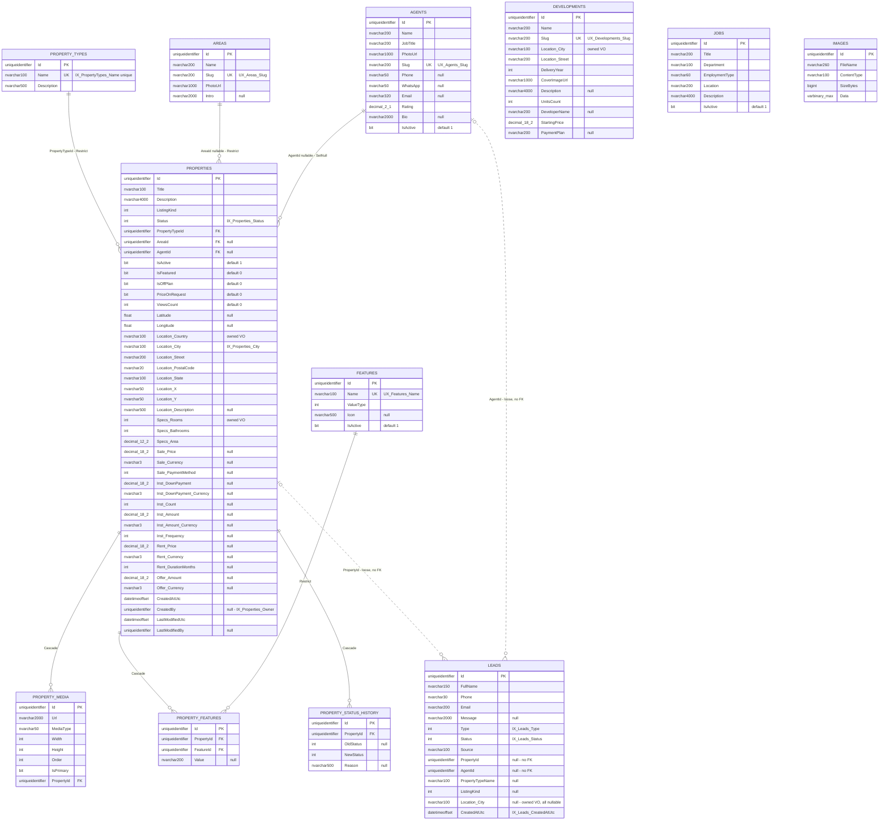

# Database

> One SQL Server database, two schemas, two independent migration histories. Everything below is derived from the EF Core configurations and the migration files.

- [Design principles](#design-principles)
- [Schemas](#schemas)
- [ER diagram — realestate](#er-diagram--realestate)
- [Tables](#tables)
- [How value objects are mapped](#how-value-objects-are-mapped)
- [Indexes](#indexes)
- [Referential integrity](#referential-integrity)
- [Auditing](#auditing)
- [Migrations](#migrations)
- [Seeding](#seeding)
- [Known issues](#known-issues)

---

## Design principles

| Principle | How it shows up |
|---|---|
| **A module owns a schema** | `auth` and `realestate`, each with its own `__EFMigrationsHistory` table, migrating independently and in either order |
| **No foreign key crosses a schema** | `Property.CreatedBy` holds an `AppUser.Id` as a bare `uniqueidentifier` with no constraint — the seam along which the modules would be split |
| **Value objects become columns, not blobs** | 100% owned types, **zero value converters, zero JSON columns**. `Sale_Price` is a real `decimal(18,2)` and is therefore filterable, sortable and indexable |
| **The aggregate boundary is visible in the schema** | `PropertyMedia` and `PropertyFeatures` cascade from `Properties`; catalogue tables are `Restrict` so a referenced row cannot vanish |
| **Deletes are hard** | No soft-delete flag, no `HasQueryFilter` anywhere in either module |

---

## Schemas

### `auth` — 9 tables

The seven standard ASP.NET Core Identity tables (`AspNetUsers`, `AspNetRoles`, `AspNetUserRoles`, `AspNetUserClaims`, `AspNetRoleClaims`, `AspNetUserLogins`, `AspNetUserTokens`) plus:

| Table | Columns |
|---|---|
| `Positions` | `Id` PK · `Name` nvarchar(100) **unique** · `Description` nvarchar(500) · `IsActive` bit default 1 · audit columns |
| `PositionPermissions` | `Id` PK · `PositionId` FK → `Positions` (Cascade) · `PermissionName` nvarchar(100) · audit columns · **unique** `(PositionId, PermissionName)` |

`AspNetUsers` is extended with `FullName` nvarchar(200), `IsMainAdmin` bit default 0, `IsActive` bit default 1, `PositionId` FK → `Positions` (**Restrict**), `CreatedAtUtc`.

**The single-Main-Admin invariant is a database constraint**, not application logic:

```sql
CREATE UNIQUE INDEX UX_Users_SingleMainAdmin
    ON auth.AspNetUsers (IsMainAdmin)
    WHERE IsMainAdmin = 1;
```

### `realestate` — 12 tables

Listed in the diagram and tables below.

---

## ER diagram — realestate

Owned value objects are shown as their flattened columns on the owner's table. Dotted lines are the two deliberate FK-less references on `Leads`.



`DEVELOPMENTS`, `JOBS` and `IMAGES` are intentionally isolated — **no foreign key in the model touches them in either direction**. In particular there is no `Development ↔ Property` relationship; off-plan inventory is expressed only by the `Properties.IsOffPlan` flag.

---

## Tables

| Table | Entity | Purpose | Rows after seeding |
|---|---|---|---|
| `Properties` | `Property` | The listing aggregate root | 49 |
| `PropertyMedia` | `Media` | Images per listing, ordered, one primary | 140 |
| `PropertyFeatures` | `PropertyFeature` | Listing ↔ amenity link with an optional value | 332 |
| `PropertyStatusHistory` | `PropertyStatusHistory` | Publication audit trail | 96 *(seeded only)* |
| `PropertyTypes` | `PropertyType` | Apartment, Villa, Townhouse, … | 8 |
| `Features` | `Feature` | The amenity catalogue | 23 |
| `Areas` | `Area` | Marketing districts | 15 |
| `Agents` | `Agent` | Sales consultants | 12 |
| `Developments` | `Development` | Off-plan projects | 14 |
| `Jobs` | `Job` | Careers page adverts | 6 |
| `Leads` | `Lead` | Inbound enquiries | 0 |
| `Images` | `StoredImage` | Binary image store | 0 |

Note two table names that differ from their entity: `Media` → **`PropertyMedia`**, `StoredImage` → **`Images`**.

---

## How value objects are mapped

Every value object is an EF **owned type**, flattened into its owner's table with explicit column names. There are no converters and no JSON columns.

`Property` alone flattens six value objects, nesting three levels deep:

```
Property
├─ Location        → Location_Country, Location_City, Location_Street, Location_PostalCode,
│                    Location_State, Location_X, Location_Y, Location_Description
├─ PropertySpecs   → Specs_Rooms, Specs_Bathrooms, Specs_Area
├─ SaleTerms?      → Sale_PaymentMethod
│  ├─ Money Price       → Sale_Price, Sale_Currency
│  └─ InstallmentPlan?  → Inst_Count, Inst_Frequency
│     ├─ Money DownPayment       → Inst_DownPayment, Inst_DownPayment_Currency
│     └─ Money InstallmentAmount → Inst_Amount, Inst_Amount_Currency
├─ RentTerms?      → Rent_DurationMonths
│  └─ Money Price       → Rent_Price, Rent_Currency
└─ Offer? (Money)  → Offer_Amount, Offer_Currency
```

**Why this matters.** A JSON column or a string converter would have made the search endpoint impossible: `WHERE Sale_Price BETWEEN @min AND @max ORDER BY Sale_Price` only works because the price is a real, typed, indexable column. The cost is a wide `Properties` table (roughly 40 columns) and the fact that adding a member to a value object is a migration.

The same `Location` value object is mapped **three times** with the same column names but different nullability — required on `Properties` and `Developments`, entirely optional on `Leads`.

### The denormalised coordinate mirror

`Location.XCoordinate` and `YCoordinate` are `nvarchar(50)` — they are the canonical, user-entered values. A viewport query cannot use them, because SQL Server would have to parse every row.

So `Properties` also carries `Latitude` and `Longitude` as real `float` columns with a composite index. `Property.SetLocation` is **private** and is the only write path for `Location`; it parses with `InvariantCulture`, range-checks, rejects the `(0,0)` placeholder and writes both representations together. Migration 3 backfilled the existing rows with a guarded `TRY_CONVERT`.

Single write path ⇒ the two representations cannot drift.

---

## Indexes

| Index | Table | Columns | Purpose |
|---|---|---|---|
| `IX_Properties_LatLng` | `Properties` | `(Latitude, Longitude)` | Viewport map query — latitude first, deliberately |
| `IX_Properties_Status` | `Properties` | `Status` | Every public query filters on it |
| `IX_Properties_Featured` | `Properties` | `(Status, IsFeatured)` | Homepage featured grid |
| `IX_Properties_City` | `Properties` | `Location_City` | City filter |
| `IX_Properties_Owner` | `Properties` | `CreatedBy` | Owner-scoped admin lists |
| `IX_Properties_Agent` | `Properties` | `AgentId` | Listings by consultant |
| `IX_Properties_AreaId` | `Properties` | `AreaId` | FK index |
| `UX_PropertyFeature_NoDuplicates` | `PropertyFeatures` | `(PropertyId, FeatureId)` **unique** | Backs the aggregate's duplicate check |
| `IX_Media_PrimaryPerProperty` | `PropertyMedia` | `(PropertyId, IsPrimary)` — **not unique** | Cover-image lookup |
| `UX_Features_Name` · `UX_Areas_Slug` · `UX_Agents_Slug` · `UX_Developments_Slug` · `IX_PropertyTypes_Name` | catalogue | unique | Slug/name uniqueness, and the seeder's idempotency key |
| `IX_Jobs_IsActive_Department` | `Jobs` | composite | Careers filter |
| `IX_Leads_Status` · `_Type` · `_CreatedAtUtc` · `_PropertyId` | `Leads` | | Admin lead list |
| `UX_Positions_Name` · `UX_PositionPermission_NoDuplicates` · `UX_Users_SingleMainAdmin` | `auth` | unique | See above |

**Missing, and it matters:** the "effective price" used for filtering and sorting is an inline `CASE` expression — `Offer ?? Sale ?? Rent ?? 0` — repeated six times across the search and map queries. No index can serve it, so **every price-filtered or price-sorted search is a scan**. A persisted computed column with an index would fix both the performance and the six duplicated copies of the expression.

---

## Referential integrity

| Relationship | Delete behaviour | Rationale |
|---|---|---|
| `Properties → PropertyTypes` | **Restrict** | A type in use cannot be deleted |
| `Properties → Areas` | **Restrict** | Same; the handler surfaces it as a 409 rather than a database error |
| `Properties → Agents` | **SetNull** | An agent leaving should orphan the assignment, not delete the listing |
| `PropertyMedia → Properties` | **Cascade** | Inside the aggregate |
| `PropertyFeatures → Properties` | **Cascade** | Inside the aggregate |
| `PropertyFeatures → Features` | **Restrict** | A catalogue amenity in use cannot be deleted |
| `PropertyStatusHistory → Properties` | **Cascade** | History dies with its subject |
| `Leads → Properties` / `→ Agents` | **No FK at all** | Deliberate: a lead is sales history and must outlive the catalogue rows it references |
| `AspNetUsers → Positions` | **Restrict** | A position assigned to an admin cannot be deleted |
| `PositionPermissions → Positions` | **Cascade** | Inside the aggregate |

The `Leads` decision has an undocumented cost: when a referenced listing is deleted, the lead detail query silently returns `null` for the property block, and nothing detects or reports the dangling reference.

---

## Auditing

Every entity inheriting `AuditableEntity` carries:

| Column | Written |
|---|---|
| `CreatedAtUtc`, `CreatedBy` | on insert only |
| `LastModifiedUtc`, `LastModifiedBy` | on insert and every update |

`AuditableEntityInterceptor` (a `SaveChangesInterceptor`) stamps them from `ICurrentUser` and `TimeProvider`. It also walks one level of owned references, so replacing `Property.Location` bumps the root's `LastModifiedUtc` even though no root scalar changed.

Two gaps worth knowing:

- **`AppUser` is not an `AuditableEntity`**, so who created, renamed, deactivated or deleted an *admin* is recorded nowhere.
- **Seeded rows have `CreatedBy = null`**, because seeding runs with no HTTP context. Every owner-scoped admin query therefore filters all 49 demo listings out.
- **`PropertyViewRecorder` bypasses the interceptor** by design — an `ExecuteUpdate` increment does not touch the change tracker and does not bump `LastModifiedUtc`.

---

## Migrations

Applied automatically at startup when `Startup__ApplyMigrations` is true (default: `IsDevelopment()`; set to `"true"` in `docker-compose.yml`). `DatabaseStartupExtensions` retries up to 20 times at 5-second intervals while SQL Server warms up, which is why a cold `docker compose up` does not crash-loop.

### `realestate` — 7 migrations

| # | Id | Changes |
|---|---|---|
| 1 | `20260727055507_InitialCreate` | Schema + `Features`, `PropertyTypes`, `Properties` (with the full flattened column set), `PropertyFeatures`, `PropertyMedia`, `PropertyStatusHistory` |
| 2 | `20260728093000_AgentsImagesDevelopmentsAreasJobs` | Adds `Properties.AreaId` + FK; creates `Agents`, `Areas`, `Developments`, `Images`, `Jobs` |
| 3 | `20260728120000_PropertyCoordinatesAndOffPlan` | Adds `Latitude`, `Longitude`, `IsOffPlan`. **Contains hand-written SQL** — a guarded `TRY_CONVERT` backfill from `Location_Y`/`Location_X`, skipping half-parseable rows and the `(0,0)` placeholder — then creates `IX_Properties_LatLng` |
| 4 | `20260728140701_DevelopmentLocation` | Renames `Developments.AreaName` → `Location_Street` and adds the other seven `Location_*` columns |
| 5 | `20260728152122_Leads` | Creates `Leads` |
| 6 | `20260728163422_PropertyAgent` | Adds `Properties.AgentId` + FK with `SetNull` |
| 7 | `20260730000000_PropertyPriceOnRequest` | Adds `PriceOnRequest bit NOT NULL DEFAULT 0` |

### `auth` — 1 migration

`20260728043240_InitialAuth` — the seven Identity tables plus `Positions` and `PositionPermissions`, all in the `auth` schema.

### A cautionary tale worth reading

Migration 7 is **hand-written**, and its own XML doc comment explains why: `Property.PriceOnRequest` and its `HasDefaultValue(false)` mapping were added to the model without generating a migration. The model and the database drifted by exactly one column, and because *every* query that materialises a `Property` includes that column, the whole application failed at startup with `Invalid column name 'PriceOnRequest'` (SQL error 207) — including the seeder's own area backfill, which had nothing to do with the new property.

The lesson is in [DEVELOPER_GUIDE.md](DEVELOPER_GUIDE.md#always-check-for-model-drift): run `dotnet ef migrations has-pending-model-changes` before committing a model change.

### Creating a migration

```bash
# RealEstate
dotnet ef migrations add <Name> \
  --project src/Modules/RealEstate/RealEstate.Infrastructure \
  --startup-project src/Host \
  --context RealEstateDbContext \
  --output-dir Data/Migrations

# Auth
dotnet ef migrations add <Name> \
  --project src/Modules/Auth/Auth.Infrastructure \
  --startup-project src/Host \
  --context AuthDbContext \
  --output-dir Data/Migrations
```

Both modules ship an `IDesignTimeDbContextFactory`, so `dotnet ef` works without building the Host.

> ⚠️ `Auth.Infrastructure/Data/AuthDbContextFactory.cs` contains a **hard-coded connection string including an `sa` password**. It is a development placeholder and must be treated as compromised — see [SECURITY.md](SECURITY.md#credential-hygiene).

---

## Seeding

Runs when `Startup__SeedData` is true. Idempotent: **match, skip, insert — never update, never delete.**

Nine ordered steps, and the order is load-bearing because ids are generated by EF on insert, so each catalogue must be saved and read back before anything can reference it:

```
1. PropertyTypes   →  Dictionary<name, id>
2. Features        →  Dictionary<name, id>
3. Areas           (before properties, so the area backfill has a catalogue)
4. Agents          (before properties, for the showcase agent slugs)
5. Properties      (9 original listings)
6. Backfill areas  (keyword match on title + street; only rows with AreaId IS NULL)
7. Showcase        (40 further listings)
8. Backfill agents (deterministic assignment; only rows with AgentId IS NULL)
9. Developments, Jobs
```

**Match keys:** `Name` for property types and features; `Slug` for areas, agents and developments — each backed by a unique index. Properties and jobs match on `Title`, which is **not** unique, so renaming a catalogue entry inserts a second row rather than updating the first.

Two details worth stealing:

- **`StableIndex`** — a hand-rolled `hash = hash * 31 + ch` used to assign agents to listings, written specifically because `string.GetHashCode` is randomised per process and would reshuffle every assignment on each restart.
- **`BackfillKeywords` is order-sensitive** — first match wins, and `porto-arabia` is deliberately listed above `the-pearl` because it is a quarter inside it.

**Failure policy:** unresolvable property types and features throw and abort startup — "silent half-seeded data is worse than a crash". Unresolvable area or agent slugs only log a warning and skip.

Total: roughly **695 rows** across ten tables in eight `SaveChanges` batches.

Demo data is no longer seeded on startup. The bootstrap (roles, the Main Admin, the default positions and the reference catalogues) runs automatically and is recorded in a `SeedHistory` table, so each batch runs exactly once and whatever you delete stays deleted. The demo listings are an explicit command that refuses to run in Production: `docker compose run --rm backend seed --demo`. There is no longer a flag to remember to turn off.

---

## Known issues

| Issue | Impact |
|---|---|
| **`PropertyStatusHistory` is never written at runtime** | Only the seeder inserts rows. The admin dashboard's Published/Sold/Rented/Archived series read from this table and are therefore permanently zero for real activity |
| **No concurrency token** | No `RowVersion` on any entity — two admins editing one listing produce silent last-writer-wins |
| **The effective-price expression is not sargable** | Every price-filtered or price-sorted search scans `Properties` |
| **"Exactly one primary image" has no database backing** | `IX_Media_PrimaryPerProperty` is deliberately non-unique; the rule lives only in `Property.AddMedia`, which `Media.Update` bypasses. A filtered unique index `WHERE IsPrimary = 1` would close it |
| **No resilience configuration** | Neither context sets `EnableRetryOnFailure` or a command timeout |
| **Blobs in `varbinary(max)` with no DB-level size guard** | The 10 MB cap is a domain constant checked only in `StoredImage.Create`, and `GetContentAsync` projects the whole blob with no streaming |
| **`Leads` has no retention policy** | Names, phone numbers and email addresses are stored indefinitely with no soft-delete and no purge |
| **The `Properties` table is wide** | ~40 columns, a consequence of flattening six value objects. Acceptable, but `SELECT *` is expensive and the read side is right to project |
