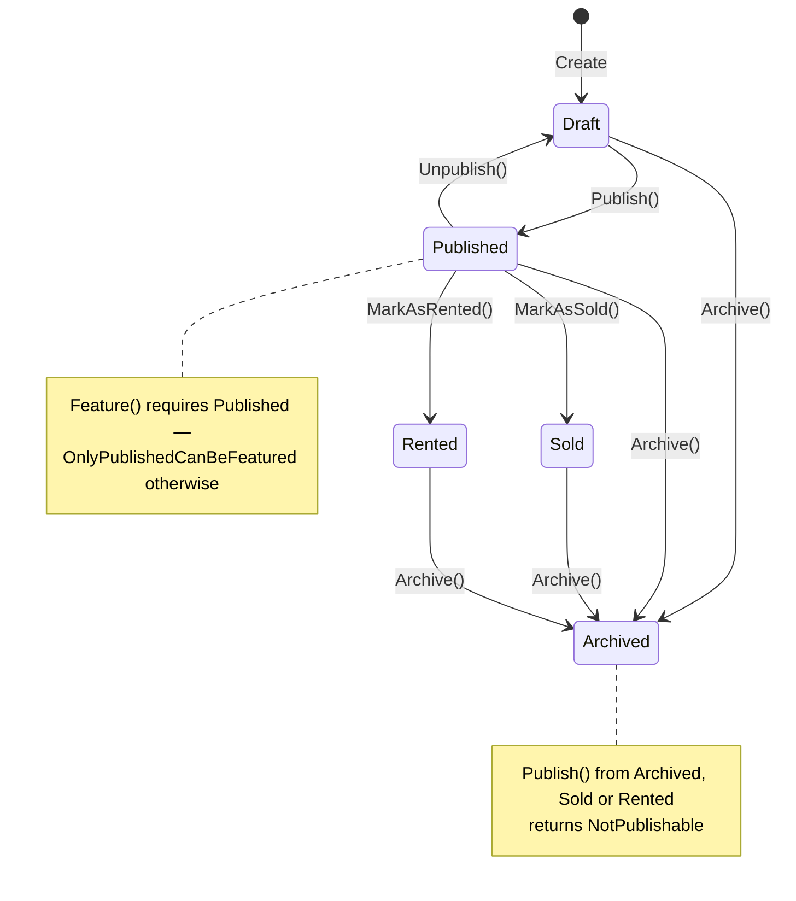

# Modules

> Two business modules sit on the shared kernel. Neither references the other; the only place they meet is `Host/Program.cs`. This document covers what each one owns, how it is built, and where its edges are.

- [Auth](#auth-module) — identity, positions, permissions, JWT
- [RealEstate](#realestate-module) — listings, agents, areas, developments, features, jobs, leads, media
- [Cross-module coupling](#cross-module-coupling)
- [Adding a module](#adding-a-module)

Every module has the same five projects:

| Project | Responsibility | May reference |
|---|---|---|
| `*.Domain` | Aggregates, value objects, invariants, domain errors | `BuildingBlocks.Domain` only |
| `*.Application` | Use cases (commands, queries, handlers, validators) and the interfaces infrastructure must satisfy | `*.Domain`, BuildingBlocks |
| `*.Infrastructure` | EF Core, repositories, read-side query services, external services | `*.Application` |
| `*.Api` | Controllers, request records, `Result<T>` → HTTP | `*.Application`, `BuildingBlocks.Api`, `BuildingBlocks.Authorization` |
| `*.Contracts` | The module's public wire surface — records only, zero dependencies | nothing |

---

# Auth module

`src/Modules/Auth/` — 96 files.

## Purpose

Auth owns **who may act on the platform and what they are allowed to do**. Concretely: the single ASP.NET Core Identity user store, the coarse role tier, the `Position` aggregate (a named bundle of permission grants), the singleton Main Admin and the invariants protecting it, password verification with lockout, JWT issuance, and the admin/position/permission management API.

It does **not** own the permission catalogue — that is a code constant in `BuildingBlocks.Authorization.AppPermissions` — nor the authorization verdict, which `PermissionAuthorizationHandler` computes for every module. Auth's job at token time is to translate database facts into signed claims.

There is **no end-user or customer identity concept**. Every row in `auth.AspNetUsers` is a staff account.

## Domain

Two entities, no value objects, no enums.

### `Position` — aggregate root

```
Position : AuditableEntity
├─ Name          string, private set, ≤100, trimmed, unique (UX_Positions_Name)
├─ Description   string, private set, ≤500
├─ IsActive      bool, private set, default true
└─ Permissions   IReadOnlyCollection<PositionPermission>  ← over a private _permissions list
```

| Method | Returns | Guards |
|---|---|---|
| `Create(name, description)` | `Result<Position>` | `NameRequired`, `NameTooLong`, `DescriptionTooLong` |
| `Update(name, description)` | `Result<Updated>` | same three; cannot change `IsActive` |
| `AssignPermission(permission)` | `Result<Updated>` | `UnknownPermission` (validated against `AppPermissions.Catalog`), `DuplicatePermission` |
| `RemovePermission(permission)` | `Result<Updated>` | `PermissionNotAssigned` |
| `Activate()` / `Deactivate()` | `Result<Updated>` | `AlreadyActive` / `AlreadyInactive` — **dead code, see below** |

`AssignPermission` is the single validation point that keeps un-catalogued strings out of the table. `PositionPermission.Create` is `internal` precisely so that this is the only door in.

> **Known gap.** `Activate()` and `Deactivate()` are never called — there is no command, no endpoint, and `Update` cannot change `IsActive`. Since `Create` always sets it `true`, **a Position can never become inactive at runtime**, which makes every `!position.IsActive` guard in the codebase (in `AssignPositionHandler`, `CreateAdminHandler` and `JwtTokenService`) unreachable.

### `PositionPermission`

An entity inside the Position aggregate — own `Id`, own table, own audit columns. Holds `PositionId` and `PermissionName`. Performs no validation of its own by design.

### Domain errors

`AdminErrors` (7), `AuthErrors` (4, all `Unauthorized`), `PositionErrors` (12). Notably `AdminErrors.MainAdminProtected` is `Forbidden` → HTTP 403.

## Identity integration

| | |
|---|---|
| User | `AppUser : IdentityUser<Guid>` — adds `FullName`, `IsMainAdmin`, `IsActive`, `PositionId?`, `CreatedAtUtc` |
| Role | `AppRole : IdentityRole<Guid>` — adds nothing |
| Context | `AuthDbContext : IdentityDbContext<AppUser, AppRole, Guid>` |
| Schema | `auth` — set *before* `base.OnModelCreating`, so the seven Identity tables land there too |
| Registration | `AddIdentityCore` (not `AddIdentity`) + `.AddRoles` + `.AddEntityFrameworkStores` + `.AddSignInManager` — no cookie UI, no default token providers |
| Password | 8+ chars, digit + upper + lower required, non-alphanumeric not required |
| Lockout | 5 failed attempts → 5 minutes, enabled for new users |

The single-Main-Admin invariant is enforced **by the database**: a filtered unique index `UX_Users_SingleMainAdmin ON AspNetUsers(IsMainAdmin) WHERE IsMainAdmin = 1`.

## JWT

| Claim | Source |
|---|---|
| `ClaimTypes.NameIdentifier` | `AppUser.Id` |
| `ClaimTypes.Email` / `ClaimTypes.Name` | Identity column / `FullName` |
| `JwtRegisteredClaimNames.Jti` | fresh GUID per token |
| `ClaimTypes.Role` (0..n) | `UserManager.GetRolesAsync` |
| `auth:permission` (0..n) | the user's position's permissions, filtered on `IsActive` |
| `auth:main_admin` | `"true"` only when the DB row says `IsMainAdmin` |

HS256, issuer + audience + lifetime validated, 1-minute clock skew, `AccessTokenMinutes` default 60. The signing secret is **fail-fast validated at startup** — missing or under 32 characters throws with an actionable message rather than surfacing as a cryptic `IDX10703` on the first login.

**No refresh tokens, no logout, no revocation.** The access token is the only credential and cannot be invalidated before expiry.

## Main Admin protection — five independent mechanisms

1. **Authorization bypass** — `auth:main_admin == "true"` satisfies every `PermissionRequirement`, checked before the permission claim.
2. **Database uniqueness** — the filtered unique index above.
3. **A single write path** — `AuthSeeder` is the *only* code in the repository that sets `IsMainAdmin = true`. `IIdentityService.CreateAdminAsync` has no parameter capable of it and hard-codes `false`; no request DTO carries the field.
4. **Handler guards** — `UpdateAdmin`, `DeactivateAdmin`, `ActivateAdmin`, `DeleteAdmin`, `AssignPosition` and `RemovePosition` all load the *target* from the database and return `MainAdminProtected` (403) if it is the Main Admin. Never derived from the payload.
5. **A second lock in infrastructure** — `IdentityService.SetActiveAsync`, `DeleteAsync` and `SetPositionAsync` repeat the check, so no future caller can bypass the handler.

This is capability-removal rather than guard-adding: privilege escalation on create is impossible because the API does not exist, not because a check rejects it.

## Application layer

**13 commands** — `Login`, `CreateAdmin`, `UpdateAdmin`, `ActivateAdmin`, `DeactivateAdmin`, `DeleteAdmin`, `AssignPosition`, `RemovePosition`, `CreatePosition`, `UpdatePosition`, `DeletePosition`, `AssignPermission`, `RemovePermission`.

**7 queries** — `GetCurrentAdmin`, `GetAdmin`, `ListAdmins` (paged, searchable), `GetPosition`, `ListPositions`, `GetPositionPermissions`, `ListPermissions` (returns `AppPermissions.Catalog` with no database access at all).

Five commands have FluentValidation validators; the rest rely on the aggregate. Every handler returns `Result<T>` — no exceptions.

## Infrastructure

| Concern | Implementation |
|---|---|
| Write side | `PositionRepository` only. **There is no `AdminRepository`** — admin writes go exclusively through `UserManager` inside `IdentityService` |
| Read side | `AdminQueries`, `PositionQueries` — `AsNoTracking` projections with correlated subqueries for position name, permissions and admin counts |
| Unit of work | `AuthUnitOfWork` — one method forwarding to `SaveChangesAsync` |
| Auditing | `AuthAuditInterceptor` — stamps `AuditableEntity` descendants. **`AppUser` is not one**, so admin mutations carry no audit trail |
| Seeding | `AuthSeeder` — roles, Main Admin, four default positions; idempotent, runs before the RealEstate seeder |

### Seeded positions

| Position | Permissions |
|---|---|
| Property Manager | 13 — property read/create/update/publish, catalogue reads, full Feature CRUD, media |
| Content Manager | 20 — full Agent, Development, Area and Job CRUD, media |
| User Manager | 3 — `User.Read`, `User.Update`, `Admin.Read` |
| Support Manager | 2 — `Property.Read`, `User.Read` |

Note what is deliberately absent from **all four**: `Admin.Create/Update/Delete/AssignPosition`, `Position.*`, `Permission.Assign`, and `Property.Delete`. Out of the box only the Main Admin can create admins, manage positions or grant permissions — a no-self-escalation floor.

> **It is a convention, not a guarantee.** Once the Main Admin grants `Permission.Assign` to any position, holders of that position can grant that same position every permission in the catalogue. Nothing checks that the caller already holds a permission before granting it.

## API

| Route | Verb | Auth | Returns |
|---|---|---|---|
| `/api/auth/login` | POST | anonymous | 200 + `AuthTokenResponse` |
| `/api/auth/me` | GET | `[Authorize]` | 200 + `CurrentAdminDto` |
| `/api/admins` | GET · POST | `Admin.Read` · `Admin.Create` | 200 paged · 201 |
| `/api/admins/{id}` | GET · PUT · DELETE | `Admin.Read` · `Admin.Update` · `Admin.Delete` | 200 · 204 · 204 |
| `/api/admins/{id}/activate` · `/deactivate` | POST | `Admin.Update` | 204 |
| `/api/admins/{id}/position` | POST · DELETE | `Admin.AssignPosition` | 204 |
| `/api/positions` | GET · POST | `Position.Read` · `Position.Create` | 200 · 201 |
| `/api/positions/{id}` | GET · PUT · DELETE | `Position.Read` · `Position.Update` · `Position.Delete` | 200 · 204 · 204 |
| `/api/positions/{id}/permissions` | GET · POST | `Permission.Read` · `Permission.Assign` | 200 · 204 |
| `/api/positions/{id}/permissions/{permission}` | DELETE | `Permission.Assign` | 204 |
| `/api/permissions` | GET | `Permission.Read` | 200 + the 41-entry catalogue |

`/api/auth/login` is the only anonymous endpoint in the module.

> **Routing caveat.** The permission-removal route puts a dot-containing string in a path segment (`.../permissions/Property.Publish`). Some hosts and proxies interpret that as a file extension; IIS in particular needs configuration for it to route.

## Module-specific notes

- **`AppPermissions.User.*` enforces nothing.** `User.Read`, `User.Update` and `User.Delete` are granted by two seeded positions, but no endpoint in either module consumes them. There is no end-user entity to manage. "User Manager" currently confers only `Admin.Read`.
- **`Auth.Contracts` is unreferenced** by any other module — a designed but unexercised surface.
- **No rate limiting on login.** Protection is Identity lockout only, which is per-account; password spraying across many accounts is unmitigated.

---

# RealEstate module

`src/Modules/RealEstate/` — 349 files, of which 212 are the Application layer.

## Purpose

RealEstate owns the property catalogue and everything that surrounds it: listings and their lifecycle, the agents who carry them, the areas and developments they sit in, the amenity catalogue, inbound leads, job adverts, and binary image storage.

## Domain

Eleven entities. One is a rich aggregate; the rest are deliberately simple.

### `Property` — the aggregate root

```
Property : AuditableEntity
├─ Title, Description
├─ Location            ← value object (owned)
├─ ListingKind         ← Sale | Rent
├─ SaleTerms?          ← VO: Money Price, PaymentMethod, InstallmentPlan?
├─ RentTerms?          ← VO: Money Price, ContractDurationMonths
├─ PropertySpecs       ← VO: Rooms, Bathrooms, AreaInSquareMeters
├─ Offer?              ← VO: Money
├─ Status              ← Draft | Published | Archived | Sold | Rented
├─ IsAvailable         ← computed: Status == Published (EF-ignored)
├─ IsActive · IsFeatured · IsOffPlan · PriceOnRequest · ViewsCount
├─ Latitude/Longitude? ← denormalised numeric mirror of Location.X/Y
├─ PropertyTypeId · AreaId? · AgentId?    ← by id, outside the boundary
├─ Media               ← IReadOnlyCollection over private _media
└─ PropertyFeatures    ← IReadOnlyCollection over private _propertyFeatures
```

**The publication state machine:**



**Invariants enforced at the root:** title present and within length bounds; description within bounds; property type set; location present; a Sale listing must carry sale terms and a Rent listing rent terms; specs non-negative; at most 20 media items; at most one primary image; no duplicate feature (compared by `FeatureId`, never by object reference — the comment records the production 500 that motivated it).

**Not enforced:** that a listing has any image at all; that `Media.PropertyId` matches the root's id; that a `PropertyFeature.Value` is consistent with the catalogue `Feature.ValueType`.

Two design details worth reading in the source:

- **`SetLocation` is private** and is the only write path for `Location`. It parses the string coordinates with `InvariantCulture` and mirrors them into the `Latitude`/`Longitude` doubles, rejecting out-of-range values and the `(0,0)` placeholder. That single path is what stops the two representations drifting.
- **`ReplaceFeatures`** reconciles in three phases — remove deselected, update survivors *in place*, add new — so surviving rows keep their identity and the unique index is not violated mid-transaction.

### Value objects

| VO | Members | Validation |
|---|---|---|
| `Money` | `Amount`, `Currency` | amount ≥ 0; currency required, trimmed, upper-cased |
| `Location` | Country, City, Street, PostalCode, State, X, Y, Description? | first four required; X/Y must parse as doubles |
| `PropertySpecs` | Rooms, Bathrooms, AreaInSquareMeters | **none — the only VO with no factory**; its rules live inside `Property` |
| `SaleTerms` | Price, PaymentMethod, InstallmentPlan? | price > 0; plan required iff method is Installment |
| `RentTerms` | Price, ContractDurationMonths | price > 0; duration > 0 |
| `InstallmentPlan` | DownPayment, Count, Amount, Frequency | all positive; **currencies must match** |

### Other aggregates

| Aggregate | Shape | Distinctive |
|---|---|---|
| `Agent` | Name, JobTitle, PhotoUrl, Slug, contacts, Rating 0–5, Bio, IsActive | slug derived from name when omitted; uniqueness is explicitly *not* an aggregate concern (the database enforces it) |
| `Area` | Name, Slug, PhotoUrl, Intro | a marketing district you browse by — deliberately distinct from `Location`, which is a postal address |
| `Development` | Name, Slug, Location, DeliveryYear, CoverImageUrl, UnitsCount, DeveloperName, StartingPrice, PaymentPlan | `StartingPrice` is a plain `decimal`, not `Money`, on purpose. **No relationship to `Property` exists** — off-plan inventory is expressed only by `Property.IsOffPlan` |
| `Feature` | Name, ValueType (Boolean/Text/Number), Icon, IsActive | the amenity catalogue; icons validated against `FeatureIconCatalog`, which mirrors the frontend's icon map |
| `Job` | Title, Department, EmploymentType, Location (a plain string), Description, IsActive | no application/candidate entity by design |
| `Lead` | Contact details, Type, Status, Source, PropertyId?, AgentId?, Location? | **one aggregate, three shapes selected by factory** — `CreateInquiry` and `CreateListingRequest`. `PropertyId`/`AgentId` are deliberately FK-less so a lead outlives the catalogue rows it points at |
| `StoredImage` | FileName, ContentType, SizeBytes, Data (`byte[]`) | **deliberately immutable — no `Update` method**, which is what makes `Cache-Control: immutable` on the serving endpoint sound |
| `PropertyType` | Name, Description | seed-only; no admin CRUD exists |
| `PropertyStatusHistory` | PropertyId, OldStatus?, NewStatus, Reason? | the only entity with no `Result`-returning factory. **Written by the seeder only** — see the caveat below |

## Application layer

**36 commands, 29 queries**, organised as vertical slices:

```
Properties/
  Admin/
    Command/CreateProperty/{CreatePropertyCommand,CreatePropertyHandler,CreatePropertyValidator}.cs
    Queries/ListPropertiesForAdmin/…
  User/
    Queries/SearchProperties/…
```

Highlights:

- **Every query projects straight to a DTO** through an `I*Queries` service. No query materialises a domain entity.
- **Every write handler ends with `IUnitOfWork.SaveChangesAsync`** — except `RecordPropertyView`, which is a deliberate `ExecuteUpdate` bypass.
- **17 of 36 commands have no validator**, relying on the aggregate. The practical consequence is that a `Guid.Empty` id yields 404 rather than 400.
- `PropertyAuthorizationPolicy` (role-based) and `PropertyOwnershipPolicy` (`CreatedBy == currentUser`) guard the Property and Lead slices. The other six slices are guarded only by controller attributes.

## Infrastructure

| Concern | Notes |
|---|---|
| Context | `RealEstateDbContext`, schema `realestate`, 10 `DbSet`s. `Media` and `PropertyFeature` deliberately have none — they are reached through the aggregate |
| VO mapping | 100% owned types, **zero value converters, zero JSON columns**, nesting three levels deep |
| Collections | `SetPropertyAccessMode(PropertyAccessMode.Field)` so EF writes `_media` directly and encapsulation survives persistence |
| Write side | 8 repositories, none of which calls `SaveChanges` |
| Read side | 8 query services, all `AsNoTracking` + `Select`, with shared `static Expression` projections so every list endpoint returns an identical shape |
| Interceptor | `AuditableEntityInterceptor` — also bumps the root when an *owned* type changes |
| Seeding | 9 ordered steps, idempotent by slug/name/title, producing ~695 rows |

The read side's most interesting method is `PropertyQueries.GetForMapAsync`: a viewport query using indexed `BETWEEN` on the real `float` columns, ordered featured-first then newest, with a deliberate `Take` cut so a zoomed-out request cannot return the whole table.

## API

19 anonymous endpoints (search, map, featured, details, related, view counter, agents, areas, developments, catalogue, jobs, two lead forms, image serving) and 34 admin endpoints across 8 resources. Full reference in [API.md](API.md).

Media upload is `multipart/form-data` on `POST /api/admin/media/images`, capped at 10 MB by the domain and 11 MiB by `[RequestSizeLimit]`, restricted to jpeg/png/webp/avif/gif, stored as `varbinary(max)` in SQL and served back from an anonymous endpoint with a one-year immutable cache header.

## Module-specific caveats

1. **`GET /api/properties/{id}` applies no visibility filter** — a Draft or Archived listing is publicly retrievable by id.
2. **`PropertyStatusHistory` is never written at runtime**, yet the admin dashboard's status series read from it. Those columns report only seeded data.
3. **`AdminLeadsController` has no `[HasPermission]`** because no `Lead.*` permission exists.
4. **No `Development ↔ Property` relationship** exists in the model.
5. **`RealEstate.Contracts` contains one empty placeholder class.**

---

# Cross-module coupling

There is currently **no runtime interaction between the two modules**. The only couplings are:

| Coupling | Kind | Risk |
|---|---|---|
| `Property.CreatedBy` holds an `AppUser.Id` | A bare `Guid` with **no foreign key** across schemas | None — this is the correct seam |
| `AuthRoles` (Auth) and `AppRoles` (RealEstate) | Two hand-maintained copies of the same three role names | Real. Nothing enforces they match; a comment asks for it. **Should be promoted into `BuildingBlocks.Authorization`** |
| `AppPermissions` | Shared kernel, consumed by both | Intended |
| `Program.cs` | Composition root, knows both | Intended |

---

# Adding a module

See [ARCHITECTURE.md §14](ARCHITECTURE.md#14-extending-the-platform-with-a-new-module) for the full recipe. In summary: five new projects, one new schema, permissions appended to `AppPermissions.Catalog`, three lines in `Program.cs`, one line in `DatabaseStartupExtensions`. No existing module changes.

The one shared capability a *reactive* module will need and which does not exist yet is **domain-event dispatch** — see [ROADMAP.md](ROADMAP.md).
