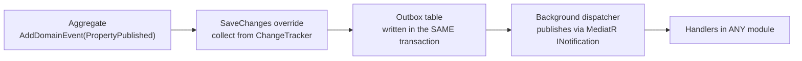

# Roadmap

> **Nothing in this document is implemented.** It describes where the architecture is deliberately pointed, and what each planned capability would cost given the current design. Everything described as existing today is stated as such and cross-referenced.
>
> It is included because the architecture only makes sense in light of it: a two-module system with sixteen projects and a shared kernel is over-engineered for a property website and correctly engineered for a platform.

---

## The thesis

The Real Estate module is the first business capability, not the system's purpose. The company's operations — enquiry follow-up, viewing appointments, commission reporting, document handling — are today spread across WhatsApp, spreadsheets and email. The platform exists so that each of those can become a module without disturbing the ones already running.

The measure of whether the architecture is working is simple: **adding capability *n+1* should not require changing capability *n*.**

---

## Prerequisite: domain events

Every reactive capability below needs the same thing, and it does not exist yet.

**Current state.** `BuildingBlocks.Domain.Entity` exposes `AddDomainEvent`, `RemoveDomainEvent`, `ClearDomainEvents` and a `[NotMapped] DomainEvents` collection. `DomainEvent` is an abstract class whose `INotification` inheritance is **commented out**. `AddDomainEvent` is called **zero times** in the entire solution, and neither `DbContext` overrides `SaveChanges`, so there is no dispatcher.

The seam is cut. Nothing flows through it.

**What it needs — three pieces:**

1. Uncomment `: INotification` on `DomainEvent` and have aggregates raise events at the points where something business-meaningful happens — `Publish()`, `MarkAsSold()`, `Lead.CreateInquiry()`.
2. Override `SaveChangesAsync` on both contexts to collect events from the change tracker and write them to an **outbox table in the same transaction**. The outbox is what makes "the listing was published *and* the notification will be sent" atomic; dispatching in-process after `SaveChanges` loses events on a crash.
3. A hosted service that reads the outbox and publishes through MediatR, with at-least-once delivery and idempotent handlers.

**Why it must come first.** Without it, a Notifications module can only be called *directly* by RealEstate — which means `RealEstate.Application` referencing `Notifications.Contracts`, and the module independence that the whole architecture protects is gone on day one.

**Estimated cost:** the outbox table, a `SaveChanges` override per context, one hosted service, and one migration per module. Under a week. It is the highest-leverage thing on this list.

---

## Planned modules

### 1. Notifications — *not implemented*

The most-requested capability and the natural first module, because the seams for it already exist. `CreateInquiryLeadHandler` marks the exact spot with a comment noting that no email or notification infrastructure exists today.

| Channel | Notes |
|---|---|
| **WhatsApp** | The primary channel in this market. The site already links to `wa.me`; automated messaging needs the WhatsApp Business API, which requires template pre-approval and a business verification process. Plan for the approval lead time, not the code |
| **Email** | Transactional first — lead acknowledgement, admin alerts, password reset. The DataProtection key ring that password-reset tokens depend on is [already configured correctly](SECURITY.md#data-protection) |
| **SMS** | Fallback for time-critical messages |
| **In-app** | A notification centre in the admin console |

Shape: a `notifications` schema with `NotificationTemplate`, `NotificationRequest` and `DeliveryAttempt`; channel adapters behind one `INotificationChannel` interface; the outbox for reliability; per-channel rate limits and a quiet-hours policy.

First event to subscribe to: `LeadCreated` → notify the assigned agent. That single flow replaces a manual step that happens several times a day.

### 2. Background jobs and scheduling — *not implemented*

Nothing currently runs outside a request. There is no `IHostedService`, no job library, no scheduler.

Immediate uses, in order of value:

| Job | Why |
|---|---|
| **Database backup** | The single largest operational gap today — see [DEPLOYMENT.md](DEPLOYMENT.md#backups--currently-missing) |
| Outbox dispatcher | The prerequisite above |
| Stale-lead reminders | "Contacted 7 days ago, no follow-up" |
| Listing expiry | Auto-archive after N days without an update |
| Search-index refresh | If full-text search lands |
| Report generation | Nightly aggregates instead of on-request `GROUP BY` |

Options: `IHostedService` with `PeriodicTimer` for the simplest cases; Hangfire or Quartz.NET when jobs need persistence, retries and a dashboard. Given that a database is already present, Hangfire's SQL Server storage is the lowest-friction step up.

### 3. Reporting and analytics — *partially implemented*

**What exists today:** `GET /api/admin/properties/dashboard-statistics` returns twelve months of listing, status and lead counts, and `most-viewed` returns a view-count leaderboard.

**What is broken about it:** the status series are read from `PropertyStatusHistory`, and **no runtime code writes to that table** — only the seeder does. The Published/Sold/Rented/Archived columns are therefore permanently zero for real activity. Fixing that is a prerequisite for any real reporting and is a small change: write a history row in `ChangePropertyPublicationStatusHandler`, which already accepts and discards a `reason`.

**What is missing:** commission and revenue reporting, agent performance, conversion funnels (view → lead → viewing → offer), area-level price trends, exports to CSV/Excel/PDF, and scheduled report delivery — which depends on both the Notifications and Jobs modules.

At current data volumes the aggregations run fine against the transactional tables. A separate read store only becomes worth it when reporting starts to interfere with the site.

### 4. Workflow automation — *not implemented*

The natural consequence of having events. Lead assignment by round-robin or area; escalation when an SLA is missed; the viewing pipeline (`Requested → Scheduled → Completed → Feedback`); approval chains for price changes above a threshold.

`Lead.Status` transitions are currently **unconstrained by design** — `SetStatus` accepts anything. That is the right starting point; a workflow engine would be the thing that later constrains them, and it should do so as configuration rather than as a new set of hardcoded transitions.

### 5. Documents and contracts — *not implemented*

Tenancy agreements, sale contracts, ID documents, KYC. Versioning, expiry tracking, and access control per document type.

Note that this is the capability that would force the [image storage decision](SYSTEM_DESIGN.md#image-path) to be revisited: contracts are larger than photos, must not live in a 50 GB Express database, and have retention requirements that `varbinary(max)` does not express.

### 6. External integrations — *not implemented*

Portal syndication (Property Finder, Bayut), accounting export, calendar sync for viewings, payment gateways for deposits.

Each is an anti-corruption layer: the external model does not enter the domain. This is precisely what the `*.Contracts` projects were shaped for — a dependency-free record surface that an adapter maps to and from.

### 7. Multi-language — *not implemented*

Arabic is the second market language and the footer already carries an Arabic licence line, so the need is real.

The work splits three ways, and only the third touches the database:

| Layer | Approach | Schema change |
|---|---|---|
| UI chrome | A translation dictionary in the frontend | none |
| Reference data — 8 property types, 23 features, 15 areas, 14 developments, 12 agents, 6 jobs | A dictionary keyed on the existing `Slug` (areas, agents, developments) or `Name` (features, types, jobs) | none |
| Free text — `Property.Title`, `Description`, `Location.StreetName` | Either generate the title from structured fields (`{rooms} {type} for {kind} in {area}` translates for free), or add nullable `*Ar` columns with fallback | one additive migration |

Roughly 78 rows of reference data cover most of the visible text with no database change at all. RTL layout, an Arabic font and `mapbox-gl-rtl-text` are the larger part of the effort.

---

## Platform capabilities, not modules

These are cross-cutting and would live in `BuildingBlocks` or the Host.

| Capability | Status | Note |
|---|---|---|
| **Caching** | ❌ | `ICachedQuery` is declared and has **zero references**. The seam exists; a `CachingBehavior` plus `HybridCache` would light it up. Highest value on the homepage and the catalogue endpoints |
| **Health checks** | ❌ | No `/health`, no Compose healthcheck on the backend. A hung-but-alive process is invisible today |
| **Rate limiting** | ❌ | ASP.NET Core's built-in limiter; login and the lead endpoints first |
| **API versioning** | ❌ | `VersionInfoTransformer` already anticipates it — its own comment says it becomes load-bearing the day a second document exists |
| **OpenTelemetry** | ❌ | Traces and metrics. The correlation-id plumbing is already in place and would slot straight in |
| **Automated tests** | ❌ | Start with domain invariants — they are pure functions needing no host. Then handler tests with an in-memory or Testcontainers database |
| **CI/CD** | ❌ | No workflow files. Build, test, `has-pending-model-changes`, `npm audit`, `dotnet list package --vulnerable` |
| **Concurrency control** | ❌ | `RowVersion` on the aggregates that two admins can edit simultaneously |
| **Full-text search** | ❌ | Search relevance currently degrades to featured-then-newest because there is no index |

---

## Sequencing

```mermaid
flowchart LR
    subgraph P0["Fix first — correctness"]
        A1["Visibility filter on<br/>property details"]
        A2["Write status-history rows"]
        A3["Permission gate on leads"]
    end
    subgraph P1["Foundations"]
        B1["Domain events<br/>+ outbox"]
        B2["Background jobs<br/>+ backups"]
        B3["Health checks<br/>+ rate limiting"]
        B4["Tests + CI"]
    end
    subgraph P2["First new module"]
        C1["Notifications<br/>email → WhatsApp"]
    end
    subgraph P3["Build out"]
        D1["Reporting"]
        D2["Workflow automation"]
        D3["Documents"]
        D4["Integrations"]
    end
    P0 --> P1 --> P2 --> P3
```

**P0** is not roadmap work — those are three live defects, documented in [ARCHITECTURE.md §15](ARCHITECTURE.md#15-known-limitations-and-engineering-backlog). They come before any new capability.

**P1 before P2** is the load-bearing ordering. Building Notifications without the outbox means either losing messages on a crash or coupling the modules directly — and the second option quietly discards the property the entire architecture was built to protect.
