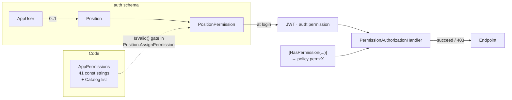

# Security

> The authentication and authorization model as implemented, followed by an honest register of what is missing. Nothing here is aspirational; every control described is in the code, and every gap is listed rather than omitted.

- [Credential hygiene](#credential-hygiene) ← **read this first**
- [Authentication](#authentication)
- [Authorization](#authorization)
- [Main Admin protection](#main-admin-protection)
- [Data protection](#data-protection)
- [Network exposure](#network-exposure)
- [Input handling](#input-handling)
- [Known gaps](#known-gaps)
- [Reporting a vulnerability](#reporting-a-vulnerability)

---

## Credential hygiene

### ⚠️ Committed development credentials

This repository is public. Three tracked files contain credential values:

| File | Contains |
|---|---|
| `src/Host/appsettings.json` | A full SQL Server connection string with an `sa` password |
| `src/Host/appsettings.Development.json` | A JWT signing secret and a Main Admin email + password |
| `src/Modules/Auth/Auth.Infrastructure/Data/AuthDbContextFactory.cs` | A hard-coded connection string with the same `sa` password, used by `dotnet ef` at design time |

These are development placeholders. **Treat every one of them as compromised.** None of the values is reproduced anywhere in this documentation.

**Remediation checklist:**

- [ ] Rotate the SQL Server `sa` password on every environment where any of these values was ever used
- [ ] Rotate the JWT signing secret — every token ever issued under it is forgeable
- [ ] Rotate the Main Admin password
- [ ] Blank the values in all three files and load them from configuration instead
- [ ] Make `AuthDbContextFactory` read from an environment variable, with a clearly-fake fallback
- [ ] Consider purging them from git history (`git filter-repo`) — note this rewrites every commit hash
- [x] ~~Rotate the Mapbox token~~ — no longer applicable. Maps run on MapLibre GL + OpenFreeMap, which need no account and no token, and MapLibre is bundled rather than fetched from a CDN

### How secrets are supposed to flow

```
Production    .env on the server (git-ignored, chmod 600)
                 → docker-compose.yml environment mapping
                 → ASP.NET Core configuration (double underscore = section separator)

Development   dotnet user-secrets  ← never appsettings.Development.json
```

`.env.example` documents every variable with generation commands and is safe to commit — it contains no values.

The API **fails fast** rather than starting insecurely: a missing `Jwt` section, a signing secret under 32 characters, or a blank `MAIN_ADMIN_EMAIL`/`PASSWORD` each abort startup with an actionable message.

---

## Authentication

| | |
|---|---|
| Scheme | JWT bearer, the process-wide default |
| Algorithm | HS256 (symmetric) |
| Validated | Issuer ✅ · Audience ✅ · Signing key ✅ · Lifetime ✅ · 1-minute clock skew |
| Lifetime | `Jwt:AccessTokenMinutes`, default 60 |
| Store | ASP.NET Core Identity, `IdentityUser<Guid>`, EF Core |
| Password policy | 8+ chars, upper + lower + digit required |
| Lockout | 5 failed attempts → 5 minutes, enabled for new users |
| Client storage | **`sessionStorage`** under `qre.accessToken` — cleared when the tab closes |

### What the token carries

`sub`/`nameid`, `email`, `name`, `jti`, role claims, one `auth:permission` claim per granted permission, and `auth:main_admin` when the database row says so. All of it is read from the database at login and signed; **no client input influences any claim**.

### Controls that are working

- **No user enumeration.** An unknown email and a wrong password return the same `AuthErrors.InvalidCredentials`.
- **Deactivated accounts cannot log in.** `IdentityService.CheckCredentialsAsync` checks `IsActive` before issuing.
- **Fail-fast on a weak secret**, with a message that says what to do rather than surfacing as a cryptic `IDX10703` on the first login.
- **`sessionStorage` over `localStorage`** narrows the window for token theft to a single tab session. It does not stop an injected script reading it.

### What is missing

**There is no way to invalidate a token.** No refresh token, no logout endpoint, no revocation list, no `SecurityStamp` validation on the bearer path. Consequently:

| Action | Effect on an existing token |
|---|---|
| Revoke a permission | **None** until it expires |
| Remove an admin's position | **None** |
| Deactivate an admin | **None** — only future logins are blocked |
| Delete an admin | **None** |

Worst case is 60 minutes of continued access after any of these. For an admin console that is the single most important gap in the module. The conventional fix is short-lived access tokens plus refresh tokens with a server-side revocation check, or a `SecurityStamp` validated on each request.

**There is no rate limiting on `/api/auth/login`.** Identity lockout is per account, so it stops brute-forcing one account and does nothing about password spraying across many, or about unauthenticated request flooding. ASP.NET Core's built-in rate limiter would close this in a few lines.

---

## Authorization

Two orthogonal mechanisms.

### 1. Permission claims



The catalogue is **code**; the grants are **data**. A permission that is not in `AppPermissions.Catalog` cannot be written to `PositionPermissions` — the aggregate rejects it — so a typo can never sit dormant waiting for a matching permission to appear. A unique index on `(PositionId, PermissionName)` backs the duplicate check.

Adding a permission requires no migration and no policy registration: `PermissionPolicyProvider` resolves any `perm:*` policy on demand.

**The whole authorization decision is made from the signed token.** The handler never touches the database. That is fast and stateless — and it is exactly why revocation does not work (above).

### 2. Row-level ownership

Independently of permissions, `PropertyOwnershipPolicy` restricts property mutations to the listing's creator for non-privileged roles, and three admin property queries scope their results with `WHERE CreatedBy = @currentUser`. The decision is made in the Application layer; the `WHERE` clause is applied in Infrastructure.

**Coverage is asymmetric.** In-handler authorization exists for the Property and Lead slices only. Agent, Area, Development, Feature, Job and Media handlers rely entirely on the controller attribute. That is sufficient while HTTP is the only entry point, and becomes a hole the moment a background job or another module dispatches those commands directly.

---

## Main Admin protection

The Main Admin bypasses every permission check, so it is defended five independent ways:

| # | Mechanism |
|---|---|
| 1 | **Authorization bypass is claim-based** — `auth:main_admin` is set from the database row at token time and protected by the signature. No API can request it |
| 2 | **Database uniqueness** — a filtered unique index `WHERE IsMainAdmin = 1` makes a second Main Admin impossible |
| 3 | **One write path** — `AuthSeeder` is the only code in the repository that sets `IsMainAdmin = true`. `CreateAdminAsync` has no parameter capable of it and hard-codes `false`; no request DTO carries the field |
| 4 | **Handler guards** — every admin-management handler loads the *target* from the database and returns `MainAdminProtected` (403) if it is the Main Admin. Never derived from the payload |
| 5 | **A second lock in infrastructure** — `IdentityService.SetActiveAsync`, `DeleteAsync` and `SetPositionAsync` repeat the check independently |

Mechanism 3 is the strongest form: the capability does not exist, rather than existing behind a check.

### The escalation floor, and its limit

None of the four seeded positions carries `Admin.Create/Update/Delete/AssignPosition`, `Position.*` or `Permission.Assign`. Out of the box, only the Main Admin can create admins, manage positions or grant permissions.

**This is a seeding convention, not a structural guarantee.** Once the Main Admin grants `Permission.Assign` to any position, holders of that position can grant that same position every permission in the catalogue — including `Admin.Create` and `Admin.Delete`. Nothing checks that the caller already holds a permission before granting it. A `CanGrant` check ("you may only grant what you hold") would close it.

---

## Data protection

ASP.NET Core's DataProtection key ring protects Identity's password-reset and email-confirmation tokens.

By default the ring is written under the container user's home directory — part of the container's **writable layer** — so every `docker compose build` discards it and invalidates outstanding tokens. This is configured explicitly instead:

- `DataProtection:KeyRingPath` points at `/home/app/.aspnet/DataProtection-Keys`, backed by the named volume `dpkeys`
- The directory is created and `chown`ed **in the image, before the `USER` switch**, because an empty named volume inherits the ownership of the directory it covers and the runtime user is an unprivileged numeric UID
- `SetApplicationName("QatarRealEstate")` is set explicitly — without it the ring is isolated by content-root path and silently stops matching if the app is ever published elsewhere
- The setting is **unset outside containers**, so `dotnet run` on a developer machine keeps the framework default

The startup warning `No XML encryptor configured. Key {…} may be persisted to storage in unencrypted form` is expected on Linux without DPAPI or a certificate. The keys are protected by filesystem permissions on the volume.

---

## Network exposure

| Container | Published ports | Reachable from |
|---|---|---|
| `caddy` (optional) | 80, 443, 443/udp | the internet |
| `frontend` | 80 when Caddy is off, otherwise none | the internet, or Caddy only |
| `backend` | **none** | nginx only |
| `sqlserver` | **none** | backend only |

The database has no `ports:` section by design. Docker writes its own iptables rules and a published port bypasses UFW entirely, so *not publishing* is a stronger control than any host firewall rule.

### TLS

Caddy is the intended edge, obtaining and renewing certificates in-process — no certbot, no cron, no nginx reload. Two modes:

| Mode | `SITE_ADDRESS` / `CADDY_TLS` | Result |
|---|---|---|
| Self-signed | `:443` / `internal` | Caddy's local CA. Every visitor sees a full-page certificate warning |
| Let's Encrypt | `hostname` / `you@example.com` | A real trusted certificate |

**Let's Encrypt cannot issue a certificate for a bare IP address.** A hostname is the only route to a trusted certificate. If the site is running on an IP, plain HTTP is usually the more honest option than a self-signed certificate — see [DEPLOYMENT.md](DEPLOYMENT.md#tls-modes).

Headers set at the Caddy edge: `X-Content-Type-Options: nosniff`, `X-Frame-Options: SAMEORIGIN`, `Referrer-Policy: strict-origin-when-cross-origin`, and the `Server` banner removed. **HSTS is off by default** (`CADDY_HSTS=max-age=0` in `.env`) and must stay off while a self-signed certificate is in use — enabling it would pin visitors to HTTPS against an untrusted certificate. It is now a variable rather than a commented-out line, so turning it on is a `.env` change and a restart. Start at `max-age=300`, confirm the site loads in a fresh browser, then raise it.

**There IS a Content-Security-Policy**, set by nginx — see `docker/nginx/security-headers.conf`. It was previously left out on the grounds that the app pulled scripts from a third-party CDN; it no longer does. MapLibre used to be loaded from `unpkg.com` at a floating major version with no integrity check, on every page including the admin property form — and the admin's JWT lives in `sessionStorage`, where any script on the page can read it. MapLibre is now a project dependency served from this origin, which is what made a real policy possible.

The policy allows scripts only from `'self'`, styles from `'self'` plus inline (React `style={{…}}` attributes), fonts from Google Fonts, images from `https:` (listing photos can be any URL an admin pastes), and connections to `'self'` plus `tiles.openfreemap.org`. `frame-ancestors 'none'`, `object-src 'none'`, `base-uri 'self'`, `form-action 'self'`. The one runtime fetch MapLibre insists on doing by URL — the RTL text plugin for Arabic map labels — is vendored into `frontend/public/vendor/`.

`X-Forwarded-Proto` is mapped through nginx to Kestrel so that the original client scheme survives the plaintext Caddy → nginx hop. `Program.cs` now calls `UseForwardedHeaders()` as its first middleware, so Kestrel sees the client's real scheme and address — which is also what makes the per-IP rate limits meaningful, since without it every request appears to come from the nginx container. `Startup__UseHttpsRedirection` stays `false` regardless: Caddy already redirects at the edge, and a second redirect inside the app is a loop waiting for a misconfiguration.

---

## Input handling

| Vector | Control |
|---|---|
| SQL injection | EF Core parameterises everything. The only raw SQL in the codebase is one migration's backfill, which takes no user input |
| XSS | React escapes by default; no `dangerouslySetInnerHTML` in the codebase |
| CSRF | Not applicable — bearer tokens in a header, no cookie authentication |
| Mass assignment | Commands are explicit `record`s with named parameters; no model binding onto entities |
| Over-posting privileged fields | `IsMainAdmin` and role are absent from every request DTO — the capability does not exist |
| Payload size | `[RequestSizeLimit]` 11 MiB on upload, 10 MB in the domain, 25 MB at nginx |
| File type | Allow-list of five image MIME types |
| Enum values | ⚠️ `Enum.IsDefined` is used **once** in the entire codebase. An out-of-range `(PropertyStatus)99` from model binding reaches the database as an integer |
| File content | ⚠️ The content type is taken from the client and **not verified against magic bytes** |

---

## Known gaps

Ordered by severity.

| # | Gap | Impact |
|---|---|---|
| 1 | **`GET /api/properties/{id}` has no visibility filter** | A Draft or Archived listing is publicly retrievable by id — full description, price, exact coordinates, media, and the assigned agent's phone and WhatsApp. **Unpublishing does not take a listing off the internet** |
| 2 | **`/api/admin/leads` has no permission gate** | No `Lead.*` entry exists in the catalogue, so the controller carries `[Authorize]` only. Any authenticated principal can read and delete every lead — names, phone numbers and email addresses. This is a personal-data exposure, not just an authorization bug |
| 3 | **No token revocation** | Up to 60 minutes of continued access after a permission is revoked or an admin is deactivated or deleted |
| 4 | **No rate limiting** | `/api/auth/login`, both lead endpoints and the view counter are anonymous and unthrottled |
| 5 | **Committed credentials** | See [Credential hygiene](#credential-hygiene) |
| 6 | **Escalation floor is a convention** | `Permission.Assign` is transitively equivalent to every permission |
| 7 | **`AppUser` mutations are unaudited** | Who created, renamed, deactivated or deleted an admin is recorded nowhere |
| 8 | **No CSP** | Deliberate, but a correctly-scoped policy would be a real improvement |
| 9 | **Content type is trusted** | A file with a JPEG MIME type and arbitrary bytes is stored and served back with that type |
| 10 | **`Leads` has no retention policy** | Personal data stored indefinitely with no soft delete and no purge. Relevant to any privacy regime that applies |
| 11 | **No dependency scanning in CI** | No Dependabot, no `dotnet list package --vulnerable`, no `npm audit` gate |
| 12 | **Thin tests** | A domain suite now covers the Property status rules, the coordinate parser, the media order and the image-upload checks, and an end-to-end run proves a delete survives a restart — see [TESTING.md](TESTING.md). Still uncovered: the Main Admin invariants, the permission filters and the token claim set, all of which live in the application layer |

### Suggested order

| Priority | Items |
|---|---|
| **Immediate** | 1, 2, 5 — data exposure |
| **Short term** | 3, 4, 6 |
| **Then** | 7, 8, 9, 10, 11, 12 |

---

## Reporting a vulnerability

Please do not open a public issue for a security problem. Contact the repository owner directly through GitHub. Include reproduction steps, affected endpoints and the impact you believe it has.
