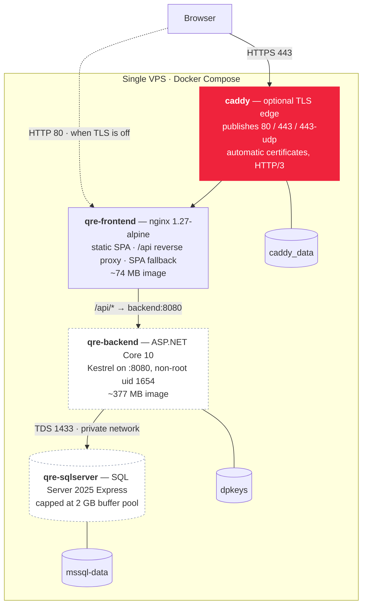
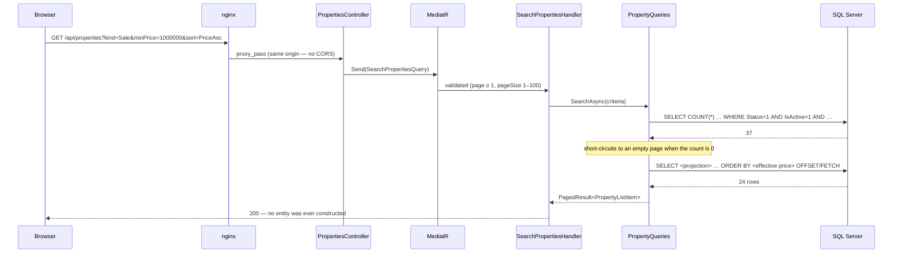
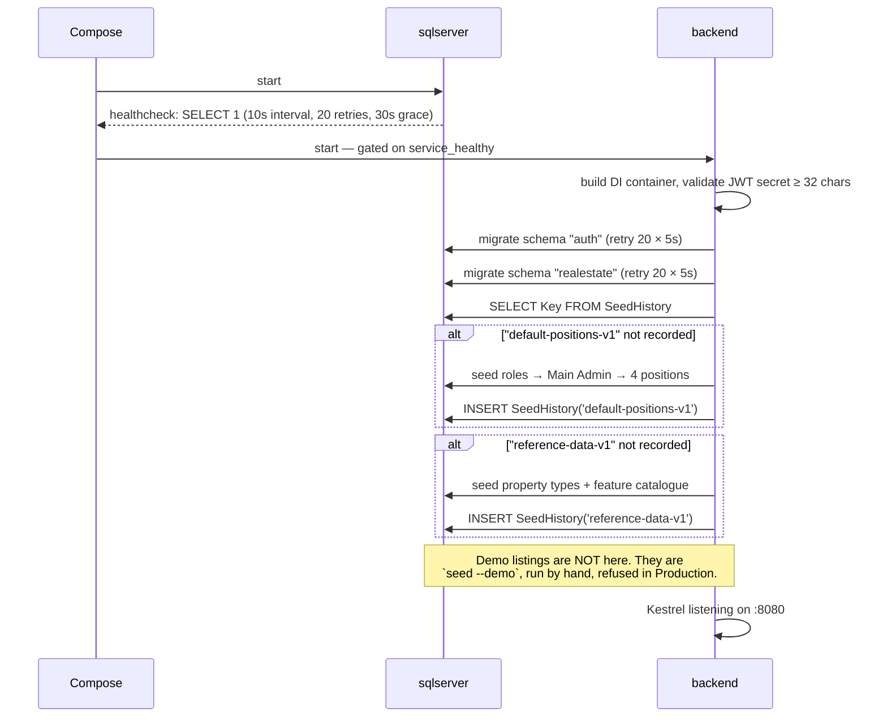

# System Design

> Runtime topology, data flow, scaling characteristics and failure modes. [ARCHITECTURE.md](ARCHITECTURE.md) covers *how the code is organised*; this document covers *how the system behaves when it is running*.

---

## Runtime topology



### The exposure rule

**Exactly one container publishes ports.** Everything else is reachable only on Docker's private network.

- `sqlserver` has no `ports:` section at all, so 1433 exists only inside the bridge network. That matters more than it looks: Docker writes its own iptables rules and a published port bypasses UFW entirely, so *not publishing* is a stronger control than any host firewall rule.
- `backend` likewise publishes nothing. Only nginx talks to it.
- Depending on the TLS mode, either `caddy` (443) or `frontend` (80) is the single public surface.

### Why nginx sits in front of the SPA

Three jobs, and the third is the one that matters architecturally:

1. **Serve static files** — hashed bundles with a one-year immutable cache, `index.html` with `no-cache` so a rebuilt bundle is picked up immediately.
2. **SPA history fallback** — `try_files $uri $uri/ /index.html`, so refreshing on `/property/buy/123` works. Deliberately *not* applied to `/assets/`, so a missing bundle 404s rather than returning HTML the browser then tries to parse as JavaScript.
3. **Reverse-proxy `/api`** — which makes the API **same-origin** with the site. CORS never fires in production; the browser's preflight machinery is simply not involved. That removes an entire category of deployment failure.

The API upstream is resolved at *request* time through Docker's embedded DNS (`resolver 127.0.0.11` plus a variable `proxy_pass`) rather than at nginx startup. Without that, nginx refuses to start if the backend container is not yet up, and never recovers.

---

## Data flow

### Read path — a property search



Two properties of this path: the count query runs first so a zero-result search costs one round trip, and the projection is composed in SQL so a 24-row page transfers 24 rows — not 24 aggregates with their media and feature collections.

### Write path

Covered in detail in [ARCHITECTURE.md §11](ARCHITECTURE.md#11-the-request-lifecycle-end-to-end). The short version: controller → MediatR → validation → handler → authorization policy → value-object factories → aggregate → repository → `IUnitOfWork.SaveChangesAsync` → one implicit EF transaction.

### Image path

```
Upload:  multipart → [RequestSizeLimit 11 MiB] → validator (≤10 MB, allowed MIME)
                   → StoredImage.Create (re-checks both) → varbinary(max)
Serve:   GET /api/media/images/{id} → anonymous
                   → Cache-Control: public, max-age=31536000, immutable
```

The immutable header is safe because `StoredImage` has **no update path** — the bytes at a given id can never change.

Storing blobs in SQL Server rather than object storage is a deliberate trade: it removes a moving part (no S3 account, no signed URLs, no lifecycle policy, no second failure domain) at the cost of database size and the fact that every image request pulls the full blob through EF into memory. SQL Server Express caps a database at 50 GB, which is the number that actually constrains this choice. The exit path is localised to one query service.

---

## Startup sequence



The migration retry loop exists because SQL Server takes 20–40 seconds to accept connections after its container starts, and the Compose healthcheck alone has proven insufficient on a cold VPS. Without the loop the API crash-loops on the very first boot of a fresh stack, every time.

**Fail-fast conditions, all deliberate:** a JWT secret shorter than 32 characters, a missing `Jwt` configuration section, and a blank `MAIN_ADMIN_EMAIL`/`PASSWORD` all abort startup with an actionable message rather than producing a subtly broken system.

---

## Scaling

### What the current shape supports

| Dimension | Today |
|---|---|
| Instances | One backend container. Kestrel is async throughout, so a single instance handles thousands of concurrent connections on modest hardware |
| Database | SQL Server 2025 **Express** — 4 cores, ~1.4 GB buffer pool, **50 GB per database** |
| Session state | None. Authentication is a stateless JWT, so the API is already horizontally scalable |
| Sticky sessions | Not required |

### Scaling up, in the order the constraints will actually bite

1. **Add a CDN in front of nginx.** The static bundle and — importantly — `/api/media/images/*` are the bulk of the bytes, and both already carry immutable cache headers. This is the cheapest possible win and requires no code change.
2. **Add caching for reads.** The `ICachedQuery` seam exists and is unused. The homepage, area list, development list and catalogue endpoints are all read-mostly and nearly static.
3. **Fix the price expression.** Every price-filtered or price-sorted search is currently a scan, because the effective price is an inline `CASE` no index can serve. A persisted computed column plus an index is a contained change.
4. **Move images out of SQL Server.** This is what will hit the 50 GB Express ceiling first. The change is localised to `StoredImageQueries` and the upload handler.
5. **Scale the API horizontally.** Two prerequisites are already handled: stateless auth, and a DataProtection key ring on a shared volume rather than in the container's writable layer. Add a load balancer in front of nginx.
6. **Scale the database.** Express → Standard, then read replicas for the read side — which is already cleanly separated behind `I*Queries` interfaces and would be the easy part.

### What would force an architecture change

Extraction of a module into its own process, and only for the reasons listed in [ARCHITECTURE.md §13](ARCHITECTURE.md#13-why-not-microservices). None of them is true today.

---

## Failure modes

| Failure | Behaviour today | Mitigation in place | Gap |
|---|---|---|---|
| SQL Server slow to start | Backend retries migrations 20 × 5s | ✅ | — |
| SQL Server transient fault at runtime | Unhandled `SqlException` → 500 | ❌ | No `EnableRetryOnFailure` on either context |
| Backend crash | Compose restarts it (`unless-stopped`) | ✅ | No healthcheck, so a *hung* process is never restarted |
| Backend down, site up | nginx returns 502 for `/api`; the SPA still loads and shows its error banner | ✅ | — |
| Backend container replaced | nginx re-resolves the upstream through Docker DNS, no restart needed | ✅ | — |
| Bad `PUBLIC_ORIGIN` | Site renders, all API calls fail or are blocked as mixed content | ❌ | Looks identical to a backend outage; nothing detects it |
| Two admins edit one listing | Silent last-writer-wins | ❌ | No `RowVersion` |
| Credential-stuffing on login | Identity lockout: 5 failures → 5 minutes, **per account** | ⚠️ | No rate limiting, so spraying across accounts is unmitigated |
| Lead-form or view-counter flooding | Unbounded | ❌ | Both are anonymous and unthrottled |
| Volume loss — `mssql-data` | Total data loss | ❌ | **No backup job exists** |
| Volume loss — `dpkeys` | Outstanding password-reset links stop validating | ✅ acceptable | — |
| Volume loss — `caddy_data` | Certificates re-requested; risks the Let's Encrypt rate limit (50/domain/week) | ⚠️ documented | — |

### The two gaps that would be worth closing first

**Backups.** There is no scheduled backup of `mssql-data`. A nightly `sqlcmd` `BACKUP DATABASE` to a mounted host directory, plus off-host copy, is an hour of work and is the single highest-value operational addition to this system.

**Health checks.** No `/health` endpoint exists and the backend has no Compose healthcheck. A hung-but-alive process is invisible to both Docker and any future load balancer.

---

## Observability

| | Status |
|---|---|
| Structured logging | ✅ Serilog to console, JSON-friendly, collected by the Docker log driver |
| Correlation id | ✅ `TraceIdentifier` pushed into `LogContext` by the first middleware — every line from every layer of a request carries it |
| Request logging | ✅ `UseSerilogRequestLogging` — method, path, status, duration |
| EF Core logging | ✅ inherited from the Serilog configuration |
| Exception logging | ✅ full detail logged, sanitised response returned |
| Metrics | ❌ no OpenTelemetry, no Prometheus |
| Tracing | ❌ none |
| Alerting | ❌ none |
| Log aggregation | ❌ `docker compose logs` only |

Serilog's minimum level is `Information` with `Microsoft.AspNetCore` overridden to `Warning`, which keeps framework noise out without hiding application detail.

---

## Capacity, from the seeded baseline

| | |
|---|---|
| Seeded rows | ~695 across 10 tables |
| Backend image | ~377 MB (~105 MB compressed) |
| Frontend image | ~74 MB (~21 MB compressed) |
| SQL Server memory cap | 2048 MB, set explicitly so it cannot starve the API on an 11 GB host |
| Property row width | ~40 columns — a consequence of flattening six value objects |
| Largest single response | An image, up to 10 MB |

At this size the whole database fits comfortably in the buffer pool and query performance is not a consideration. The numbers that will move first as real data arrives are the image blobs and the unindexed price sort.

---

## The platform view

The Real Estate module is the first tenant of this runtime, not the runtime's purpose. The properties of the design that make a second business capability cheap are:

| Property | Consequence for module #2 |
|---|---|
| One process, one container image | No new deployment target, no new pipeline |
| One database, schema-per-module | A new schema and a new migration history — no coordination with the existing ones |
| Stateless authentication | The new module's endpoints are authorized by the same claims with no extra infrastructure |
| Permission catalogue in the shared kernel | New permissions are constants; administrators can grant them the moment the code ships |
| A single composition root | Three lines in `Program.cs` |

The one shared capability a *reactive* module will need — domain-event dispatch — does not exist yet. That is the first item in [ROADMAP.md](ROADMAP.md), and it is a prerequisite for notifications, background jobs and workflow automation alike.
